# Projects and dependencies analysis

This document provides a comprehensive overview of the projects and their dependencies in the context of upgrading to .NETCoreApp,Version=v10.0.

## Table of Contents

- [Executive Summary](#executive-Summary)
  - [Highlevel Metrics](#highlevel-metrics)
  - [Projects Compatibility](#projects-compatibility)
  - [Package Compatibility](#package-compatibility)
  - [API Compatibility](#api-compatibility)
- [Aggregate NuGet packages details](#aggregate-nuget-packages-details)
- [Top API Migration Challenges](#top-api-migration-challenges)
  - [Technologies and Features](#technologies-and-features)
  - [Most Frequent API Issues](#most-frequent-api-issues)
- [Projects Relationship Graph](#projects-relationship-graph)
- [Project Details](#project-details)

  - [BenchmarkSuite1\BenchmarkSuite1.csproj](#benchmarksuite1benchmarksuite1csproj)
  - [D:\repos2026\AutodeskIntegration\SiOffice.AutodeskConnector\SiOffice.AutodeskConnector.csproj](#d:repos2026autodeskintegrationsiofficeautodeskconnectorsiofficeautodeskconnectorcsproj)
  - [D:\repos2026\AutodeskIntegration\SiOffice.GoogleConnector\SiOffice.GoogleConnector.csproj](#d:repos2026autodeskintegrationsiofficegoogleconnectorsiofficegoogleconnectorcsproj)
  - [D:\repos2026\SiNetSQL\SiNetSQL.E2ETests\SiNetSQL.E2ETests.csproj](#d:repos2026sinetsqlsinetsqle2etestssinetsqle2etestscsproj)
  - [D:\repos2026\SiNetSQL\SiNetSQL.Tests\SiNetSQL.Tests.csproj](#d:repos2026sinetsqlsinetsqltestssinetsqltestscsproj)
  - [D:\repos2026\SiNetSQL\SiNetSQL\SiNetSQL.csproj](#d:repos2026sinetsqlsinetsqlsinetsqlcsproj)
  - [MasterPlan.SyncEngine\MasterPlan.SyncEngine.csproj](#masterplansyncenginemasterplansyncenginecsproj)
  - [SiMasterPlanWeb\SiMasterPlanWeb.csproj](#simasterplanwebsimasterplanwebcsproj)
  - [SiNetProjectManagerV2\SiNetProjectManagerV2.csproj](#sinetprojectmanagerv2sinetprojectmanagerv2csproj)
  - [SiOffice.AccService\SiOffice.AccService.csproj](#siofficeaccservicesiofficeaccservicecsproj)

## Executive Summary

### Highlevel Metrics

| Metric | Count | Status |
| :--- | :---: | :--- |
| Total Projects | 10 | All require upgrade |
| Total NuGet Packages | 45 | 21 need upgrade |
| Total Code Files | 657 |  |
| Total Code Files with Incidents | 61 |  |
| Total Lines of Code | 461798 |  |
| Total Number of Issues | 2857 |  |
| Estimated LOC to modify | 2821+ | at least 0.6% of codebase |

### Projects Compatibility

| Project | Target Framework | Difficulty | Package Issues | API Issues | Est. LOC Impact | Description |
| :--- | :---: | :---: | :---: | :---: | :---: | :--- |
| [BenchmarkSuite1\BenchmarkSuite1.csproj](#benchmarksuite1benchmarksuite1csproj) | net8.0-windows | 🟢 Low | 0 | 0 |  | DotNetCoreApp, Sdk Style = True |
| [D:\repos2026\AutodeskIntegration\SiOffice.AutodeskConnector\SiOffice.AutodeskConnector.csproj](#d:repos2026autodeskintegrationsiofficeautodeskconnectorsiofficeautodeskconnectorcsproj) | net8.0 | 🟢 Low | 0 | 26 | 26+ | ClassLibrary, Sdk Style = True |
| [D:\repos2026\AutodeskIntegration\SiOffice.GoogleConnector\SiOffice.GoogleConnector.csproj](#d:repos2026autodeskintegrationsiofficegoogleconnectorsiofficegoogleconnectorcsproj) | net8.0-windows | 🟢 Low | 0 | 16 | 16+ | Wpf, Sdk Style = True |
| [D:\repos2026\SiNetSQL\SiNetSQL.E2ETests\SiNetSQL.E2ETests.csproj](#d:repos2026sinetsqlsinetsqle2etestssinetsqle2etestscsproj) | net8.0-windows | 🟢 Low | 4 | 2 | 2+ | DotNetCoreApp, Sdk Style = True |
| [D:\repos2026\SiNetSQL\SiNetSQL.Tests\SiNetSQL.Tests.csproj](#d:repos2026sinetsqlsinetsqltestssinetsqltestscsproj) | net8.0-windows | 🟢 Low | 2 | 0 |  | Wpf, Sdk Style = True |
| [D:\repos2026\SiNetSQL\SiNetSQL\SiNetSQL.csproj](#d:repos2026sinetsqlsinetsqlsinetsqlcsproj) | net8.0-windows | 🟡 Medium | 6 | 2748 | 2748+ | ClassLibrary, Sdk Style = True |
| [MasterPlan.SyncEngine\MasterPlan.SyncEngine.csproj](#masterplansyncenginemasterplansyncenginecsproj) | net8.0 | 🟢 Low | 4 | 28 | 28+ | DotNetCoreApp, Sdk Style = True |
| [SiMasterPlanWeb\SiMasterPlanWeb.csproj](#simasterplanwebsimasterplanwebcsproj) | net8.0 | 🟢 Low | 0 | 0 |  | ClassLibrary, Sdk Style = True |
| [SiNetProjectManagerV2\SiNetProjectManagerV2.csproj](#sinetprojectmanagerv2sinetprojectmanagerv2csproj) | net8.0-windows | 🟢 Low | 8 | 0 |  | Wpf, Sdk Style = True |
| [SiOffice.AccService\SiOffice.AccService.csproj](#siofficeaccservicesiofficeaccservicecsproj) | net8.0-windows | 🟢 Low | 2 | 1 | 1+ | AspNetCore, Sdk Style = True |

### Package Compatibility

| Status | Count | Percentage |
| :--- | :---: | :---: |
| ✅ Compatible | 24 | 53.3% |
| ⚠️ Incompatible | 2 | 4.4% |
| 🔄 Upgrade Recommended | 19 | 42.2% |
| ***Total NuGet Packages*** | ***45*** | ***100%*** |

### API Compatibility

| Category | Count | Impact |
| :--- | :---: | :--- |
| 🔴 Binary Incompatible | 2704 | High - Require code changes |
| 🟡 Source Incompatible | 43 | Medium - Needs re-compilation and potential conflicting API error fixing |
| 🔵 Behavioral change | 74 | Low - Behavioral changes that may require testing at runtime |
| ✅ Compatible | 615282 |  |
| ***Total APIs Analyzed*** | ***618103*** |  |

## Aggregate NuGet packages details

| Package | Current Version | Suggested Version | Projects | Description |
| :--- | :---: | :---: | :--- | :--- |
| BenchmarkDotNet | 0.15.2 |  | [BenchmarkSuite1.csproj](#benchmarksuite1benchmarksuite1csproj) | ✅Compatible |
| Dapper | 2.1.35 |  | [MasterPlan.SyncEngine.csproj](#masterplansyncenginemasterplansyncenginecsproj) [SiOffice.GoogleConnector.csproj](#d:repos2026autodeskintegrationsiofficegoogleconnectorsiofficegoogleconnectorcsproj) | ✅Compatible |
| Extended.Wpf.Toolkit | 4.7.25104.5739 |  | [SiNetProjectManagerV2.csproj](#sinetprojectmanagerv2sinetprojectmanagerv2csproj) | ✅Compatible |
| Google.Apis.Auth | 1.73.0 |  | [SiNetSQL.E2ETests.csproj](#d:repos2026sinetsqlsinetsqle2etestssinetsqle2etestscsproj) [SiOffice.GoogleConnector.csproj](#d:repos2026autodeskintegrationsiofficegoogleconnectorsiofficegoogleconnectorcsproj) | ✅Compatible |
| Google.Apis.Docs.v1 | 1.73.0.4031 |  | [SiOffice.GoogleConnector.csproj](#d:repos2026autodeskintegrationsiofficegoogleconnectorsiofficegoogleconnectorcsproj) | ✅Compatible |
| Google.Apis.Drive.v3 | 1.73.0.3996 |  | [SiOffice.GoogleConnector.csproj](#d:repos2026autodeskintegrationsiofficegoogleconnectorsiofficegoogleconnectorcsproj) | ✅Compatible |
| Google.Apis.Gmail.v1 | 1.73.0.4029 |  | [SiNetSQL.E2ETests.csproj](#d:repos2026sinetsqlsinetsqle2etestssinetsqle2etestscsproj) [SiOffice.GoogleConnector.csproj](#d:repos2026autodeskintegrationsiofficegoogleconnectorsiofficegoogleconnectorcsproj) | ✅Compatible |
| Google.Apis.Sheets.v4 | 1.72.0.3966 |  | [SiOffice.GoogleConnector.csproj](#d:repos2026autodeskintegrationsiofficegoogleconnectorsiofficegoogleconnectorcsproj) | ✅Compatible |
| Microsoft.Data.SqlClient | 5.2.2 |  | [MasterPlan.SyncEngine.csproj](#masterplansyncenginemasterplansyncenginecsproj) [SiOffice.GoogleConnector.csproj](#d:repos2026autodeskintegrationsiofficegoogleconnectorsiofficegoogleconnectorcsproj) | ✅Compatible |
| Microsoft.EntityFrameworkCore | 8.0.12 | 10.0.7 | [SiNetSQL.csproj](#d:repos2026sinetsqlsinetsqlsinetsqlcsproj) | NuGet package upgrade is recommended |
| Microsoft.EntityFrameworkCore.Design | 8.0.12 | 10.0.7 | [SiNetProjectManagerV2.csproj](#sinetprojectmanagerv2sinetprojectmanagerv2csproj) | NuGet package upgrade is recommended |
| Microsoft.EntityFrameworkCore.InMemory | 8.0.12 | 10.0.7 | [SiNetSQL.Tests.csproj](#d:repos2026sinetsqlsinetsqltestssinetsqltestscsproj) | NuGet package upgrade is recommended |
| Microsoft.EntityFrameworkCore.SqlServer | 8.0.12 | 10.0.7 | [SiNetSQL.csproj](#d:repos2026sinetsqlsinetsqlsinetsqlcsproj) [SiNetSQL.E2ETests.csproj](#d:repos2026sinetsqlsinetsqle2etestssinetsqle2etestscsproj) [SiOffice.AccService.csproj](#siofficeaccservicesiofficeaccservicecsproj) | NuGet package upgrade is recommended |
| Microsoft.EntityFrameworkCore.Tools | 8.0.12 | 10.0.7 | [SiNetSQL.csproj](#d:repos2026sinetsqlsinetsqlsinetsqlcsproj) | NuGet package upgrade is recommended |
| Microsoft.Extensions.Configuration | 8.0.0 | 10.0.7 | [MasterPlan.SyncEngine.csproj](#masterplansyncenginemasterplansyncenginecsproj) [SiNetProjectManagerV2.csproj](#sinetprojectmanagerv2sinetprojectmanagerv2csproj) | NuGet package upgrade is recommended |
| Microsoft.Extensions.Configuration.Binder | 8.0.2 | 10.0.7 | [SiNetSQL.E2ETests.csproj](#d:repos2026sinetsqlsinetsqle2etestssinetsqle2etestscsproj) | NuGet package upgrade is recommended |
| Microsoft.Extensions.Configuration.EnvironmentVariables | 8.0.0 | 10.0.7 | [SiNetProjectManagerV2.csproj](#sinetprojectmanagerv2sinetprojectmanagerv2csproj) | NuGet package upgrade is recommended |
| Microsoft.Extensions.Configuration.Json | 8.0.0 | 10.0.7 | [MasterPlan.SyncEngine.csproj](#masterplansyncenginemasterplansyncenginecsproj) | NuGet package upgrade is recommended |
| Microsoft.Extensions.Configuration.Json | 8.0.1 | 10.0.7 | [SiNetProjectManagerV2.csproj](#sinetprojectmanagerv2sinetprojectmanagerv2csproj) [SiNetSQL.E2ETests.csproj](#d:repos2026sinetsqlsinetsqle2etestssinetsqle2etestscsproj) | NuGet package upgrade is recommended |
| Microsoft.Extensions.DependencyInjection | 8.0.1 | 10.0.7 | [SiNetProjectManagerV2.csproj](#sinetprojectmanagerv2sinetprojectmanagerv2csproj) | NuGet package upgrade is recommended |
| Microsoft.Extensions.DependencyInjection.Abstractions | 8.0.2 | 10.0.7 | [SiNetSQL.csproj](#d:repos2026sinetsqlsinetsqlsinetsqlcsproj) | NuGet package upgrade is recommended |
| Microsoft.Extensions.Hosting.WindowsServices | 8.0.1 | 10.0.7 | [SiOffice.AccService.csproj](#siofficeaccservicesiofficeaccservicecsproj) | NuGet package upgrade is recommended |
| Microsoft.Extensions.Http | 8.0.1 | 10.0.7 | [SiNetProjectManagerV2.csproj](#sinetprojectmanagerv2sinetprojectmanagerv2csproj) | NuGet package upgrade is recommended |
| Microsoft.Extensions.Logging | 8.0.0 | 10.0.7 | [MasterPlan.SyncEngine.csproj](#masterplansyncenginemasterplansyncenginecsproj) | NuGet package upgrade is recommended |
| Microsoft.Extensions.Logging | 8.0.1 | 10.0.7 | [SiNetProjectManagerV2.csproj](#sinetprojectmanagerv2sinetprojectmanagerv2csproj) | NuGet package upgrade is recommended |
| Microsoft.Extensions.Logging.Abstractions | 8.0.2 | 10.0.7 | [SiNetSQL.csproj](#d:repos2026sinetsqlsinetsqlsinetsqlcsproj) | NuGet package upgrade is recommended |
| Microsoft.Extensions.Logging.Console | 8.0.0 | 10.0.7 | [MasterPlan.SyncEngine.csproj](#masterplansyncenginemasterplansyncenginecsproj) | NuGet package upgrade is recommended |
| Microsoft.NET.Test.Sdk | 17.8.0 |  | [SiNetSQL.E2ETests.csproj](#d:repos2026sinetsqlsinetsqle2etestssinetsqle2etestscsproj) [SiNetSQL.Tests.csproj](#d:repos2026sinetsqlsinetsqltestssinetsqltestscsproj) | ✅Compatible |
| Microsoft.SqlServer.SqlManagementObjects | 171.30.0 |  | [MasterPlan.SyncEngine.csproj](#masterplansyncenginemasterplansyncenginecsproj) | ✅Compatible |
| Microsoft.VisualStudio.DiagnosticsHub.BenchmarkDotNetDiagnosers | 18.3.36812.1 |  | [BenchmarkSuite1.csproj](#benchmarksuite1benchmarksuite1csproj) | ✅Compatible |
| Microsoft.Web.WebView2 | 1.0.3719.77 |  | [SiNetProjectManagerV2.csproj](#sinetprojectmanagerv2sinetprojectmanagerv2csproj) | ✅Compatible |
| Microsoft.Xaml.Behaviors.Wpf | 1.1.135 | 1.1.39 | [SiNetSQL.csproj](#d:repos2026sinetsqlsinetsqlsinetsqlcsproj) | ⚠️NuGet package is incompatible |
| Microsoft-WindowsAPICodePack-Shell | 1.1.5 |  | [SiNetSQL.csproj](#d:repos2026sinetsqlsinetsqlsinetsqlcsproj) | ✅Compatible |
| Newtonsoft.Json | 13.0.4 |  | [SiOffice.AutodeskConnector.csproj](#d:repos2026autodeskintegrationsiofficeautodeskconnectorsiofficeautodeskconnectorcsproj) | ✅Compatible |
| PDFsharp | 6.2.4 |  | [SiNetProjectManagerV2.csproj](#sinetprojectmanagerv2sinetprojectmanagerv2csproj) | ✅Compatible |
| RestSharp | 113.1.0 |  | [SiOffice.AutodeskConnector.csproj](#d:repos2026autodeskintegrationsiofficeautodeskconnectorsiofficeautodeskconnectorcsproj) | ✅Compatible |
| Serilog | 3.1.1 |  | [SiNetProjectManagerV2.csproj](#sinetprojectmanagerv2sinetprojectmanagerv2csproj) [SiNetSQL.csproj](#d:repos2026sinetsqlsinetsqlsinetsqlcsproj) | ✅Compatible |
| Serilog.AspNetCore | 8.0.3 |  | [SiOffice.AccService.csproj](#siofficeaccservicesiofficeaccservicecsproj) | ✅Compatible |
| Serilog.Extensions.Logging | 8.0.0 |  | [SiNetProjectManagerV2.csproj](#sinetprojectmanagerv2sinetprojectmanagerv2csproj) | ✅Compatible |
| Serilog.Sinks.Async | 1.5.0 |  | [SiNetProjectManagerV2.csproj](#sinetprojectmanagerv2sinetprojectmanagerv2csproj) | ✅Compatible |
| Serilog.Sinks.File | 5.0.0 |  | [SiNetProjectManagerV2.csproj](#sinetprojectmanagerv2sinetprojectmanagerv2csproj) | ✅Compatible |
| Serilog.Sinks.File | 6.0.0 |  | [SiOffice.AccService.csproj](#siofficeaccservicesiofficeaccservicecsproj) | ✅Compatible |
| System.DirectoryServices.AccountManagement | 8.0.1 | 10.0.7 | [SiNetProjectManagerV2.csproj](#sinetprojectmanagerv2sinetprojectmanagerv2csproj) | NuGet package upgrade is recommended |
| xunit | 2.6.6 |  | [SiNetSQL.E2ETests.csproj](#d:repos2026sinetsqlsinetsqle2etestssinetsqle2etestscsproj) [SiNetSQL.Tests.csproj](#d:repos2026sinetsqlsinetsqltestssinetsqltestscsproj) | ⚠️NuGet package is deprecated |
| xunit.runner.visualstudio | 2.5.6 |  | [SiNetSQL.E2ETests.csproj](#d:repos2026sinetsqlsinetsqle2etestssinetsqle2etestscsproj) [SiNetSQL.Tests.csproj](#d:repos2026sinetsqlsinetsqltestssinetsqltestscsproj) | ✅Compatible |

## Top API Migration Challenges

### Technologies and Features

| Technology | Issues | Percentage | Migration Path |
| :--- | :---: | :---: | :--- |
| WPF (Windows Presentation Foundation) | 634 | 22.5% | WPF APIs for building Windows desktop applications with XAML-based UI that are available in .NET on Windows. WPF provides rich desktop UI capabilities with data binding and styling. Enable Windows Desktop support: Option 1 (Recommended): Target net9.0-windows; Option 2: Add <UseWindowsDesktop>true</UseWindowsDesktop>. |
| GDI+ / System.Drawing | 19 | 0.7% | System.Drawing APIs for 2D graphics, imaging, and printing that are available via NuGet package System.Drawing.Common. Note: Not recommended for server scenarios due to Windows dependencies; consider cross-platform alternatives like SkiaSharp or ImageSharp for new code. |
| Windows Forms | 5 | 0.2% | Windows Forms APIs for building Windows desktop applications with traditional Forms-based UI that are available in .NET on Windows. Enable Windows Desktop support: Option 1 (Recommended): Target net9.0-windows; Option 2: Add <UseWindowsDesktop>true</UseWindowsDesktop>; Option 3 (Legacy): Use Microsoft.NET.Sdk.WindowsDesktop SDK. |
| Windows Forms Legacy Controls | 2 | 0.1% | Legacy Windows Forms controls that have been removed from .NET Core/5+ including StatusBar, DataGrid, ContextMenu, MainMenu, MenuItem, and ToolBar. These controls were replaced by more modern alternatives. Use ToolStrip, MenuStrip, ContextMenuStrip, and DataGridView instead. |

### Most Frequent API Issues

| API | Count | Percentage | Category |
| :--- | :---: | :---: | :--- |
| T:System.Windows.MessageBoxButton | 319 | 11.3% | Binary Incompatible |
| T:System.Windows.MessageBoxImage | 317 | 11.2% | Binary Incompatible |
| T:System.Windows.MessageBoxResult | 228 | 8.1% | Binary Incompatible |
| T:System.Windows.MessageBox | 152 | 5.4% | Binary Incompatible |
| T:System.Windows.Application | 148 | 5.2% | Binary Incompatible |
| M:System.Windows.MessageBox.Show(System.String,System.String,System.Windows.MessageBoxButton,System.Windows.MessageBoxImage) | 141 | 5.0% | Binary Incompatible |
| F:System.Windows.MessageBoxButton.OK | 132 | 4.7% | Binary Incompatible |
| P:System.Windows.Application.Current | 74 | 2.6% | Binary Incompatible |
| T:System.ComponentModel.ICollectionView | 74 | 2.6% | Binary Incompatible |
| T:System.Windows.Threading.Dispatcher | 69 | 2.4% | Binary Incompatible |
| P:System.Windows.Threading.DispatcherObject.Dispatcher | 69 | 2.4% | Binary Incompatible |
| F:System.Windows.MessageBoxImage.Error | 67 | 2.4% | Binary Incompatible |
| F:System.Windows.MessageBoxImage.Warning | 57 | 2.0% | Binary Incompatible |
| T:System.Uri | 42 | 1.5% | Behavioral Change |
| T:System.Windows.Visibility | 36 | 1.3% | Binary Incompatible |
| M:System.Windows.Threading.Dispatcher.Invoke(System.Action) | 32 | 1.1% | Binary Incompatible |
| P:System.Windows.Controls.HeaderedItemsControl.Header | 26 | 0.9% | Binary Incompatible |
| F:System.Windows.MessageBoxResult.Yes | 25 | 0.9% | Binary Incompatible |
| F:System.Windows.MessageBoxButton.YesNo | 25 | 0.9% | Binary Incompatible |
| P:System.Windows.Controls.MenuItem.Command | 24 | 0.9% | Binary Incompatible |
| T:System.Windows.Controls.MenuItem | 24 | 0.9% | Binary Incompatible |
| M:System.Windows.Controls.MenuItem.#ctor | 24 | 0.9% | Binary Incompatible |
| T:System.Windows.Controls.ItemCollection | 24 | 0.9% | Binary Incompatible |
| P:System.Windows.Controls.ItemsControl.Items | 24 | 0.9% | Binary Incompatible |
| M:System.Windows.Controls.ItemCollection.Add(System.Object) | 24 | 0.9% | Binary Incompatible |
| M:System.ComponentModel.ICollectionView.Refresh | 22 | 0.8% | Binary Incompatible |
| T:System.Windows.Threading.DispatcherOperation | 22 | 0.8% | Binary Incompatible |
| T:System.Windows.Controls.ContextMenu | 21 | 0.7% | Binary Incompatible |
| F:System.Windows.MessageBoxImage.Information | 19 | 0.7% | Binary Incompatible |
| M:System.Windows.Threading.Dispatcher.InvokeAsync(System.Action) | 17 | 0.6% | Binary Incompatible |
| T:System.Text.Json.JsonDocument | 16 | 0.6% | Behavioral Change |
| M:System.Windows.Threading.Dispatcher.CheckAccess | 16 | 0.6% | Binary Incompatible |
| M:System.TimeSpan.FromSeconds(System.Double) | 15 | 0.5% | Source Incompatible |
| F:System.Windows.MessageBoxImage.Question | 15 | 0.5% | Binary Incompatible |
| T:System.Windows.Media.Brush | 14 | 0.5% | Binary Incompatible |
| T:System.Windows.Input.CommandManager | 12 | 0.4% | Binary Incompatible |
| M:System.Windows.Input.CommandManager.InvalidateRequerySuggested | 12 | 0.4% | Binary Incompatible |
| P:System.Windows.UIElement.Visibility | 12 | 0.4% | Binary Incompatible |
| P:Microsoft.Win32.FileDialog.FileName | 11 | 0.4% | Binary Incompatible |
| T:System.Windows.Media.ImageSource | 11 | 0.4% | Binary Incompatible |
| T:System.Windows.Threading.DispatcherTimer | 11 | 0.4% | Binary Incompatible |
| T:System.Windows.Controls.ValidationResult | 10 | 0.4% | Binary Incompatible |
| T:System.Windows.Media.DoubleCollection | 10 | 0.4% | Binary Incompatible |
| P:System.ComponentModel.ICollectionView.Filter | 9 | 0.3% | Binary Incompatible |
| T:System.Windows.Data.CollectionViewSource | 9 | 0.3% | Binary Incompatible |
| M:System.Windows.Data.CollectionViewSource.GetDefaultView(System.Object) | 9 | 0.3% | Binary Incompatible |
| F:System.Windows.Visibility.Collapsed | 9 | 0.3% | Binary Incompatible |
| T:System.Windows.Style | 9 | 0.3% | Binary Incompatible |
| T:System.Net.Http.HttpContent | 8 | 0.3% | Behavioral Change |
| T:System.Windows.Threading.DispatcherPriority | 8 | 0.3% | Binary Incompatible |

## Projects Relationship Graph

Legend:
📦 SDK-style project
⚙️ Classic project

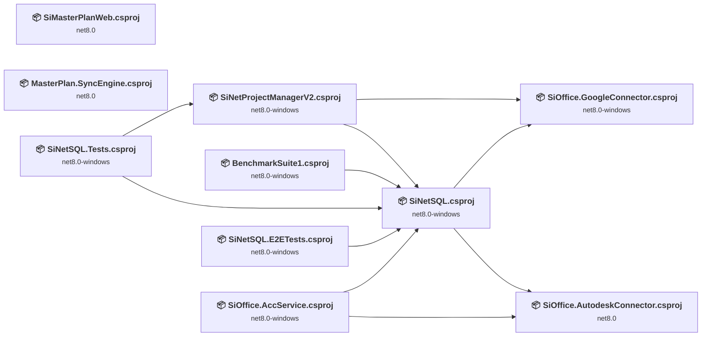

## Project Details

### BenchmarkSuite1\BenchmarkSuite1.csproj

#### Project Info

- **Current Target Framework:** net8.0-windows
- **Proposed Target Framework:** net10.0--windows
- **SDK-style**: True
- **Project Kind:** DotNetCoreApp
- **Dependencies**: 1
- **Dependants**: 0
- **Number of Files**: 3
- **Number of Files with Incidents**: 1
- **Lines of Code**: 222
- **Estimated LOC to modify**: 0+ (at least 0.0% of the project)

#### Dependency Graph

Legend:
📦 SDK-style project
⚙️ Classic project

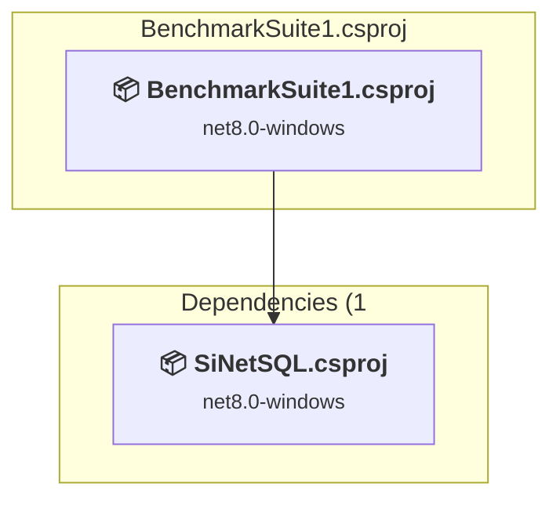

### API Compatibility

| Category | Count | Impact |
| :--- | :---: | :--- |
| 🔴 Binary Incompatible | 0 | High - Require code changes |
| 🟡 Source Incompatible | 0 | Medium - Needs re-compilation and potential conflicting API error fixing |
| 🔵 Behavioral change | 0 | Low - Behavioral changes that may require testing at runtime |
| ✅ Compatible | 443 |  |
| ***Total APIs Analyzed*** | ***443*** |  |

### D:\repos2026\AutodeskIntegration\SiOffice.AutodeskConnector\SiOffice.AutodeskConnector.csproj

#### Project Info

- **Current Target Framework:** net8.0
- **Proposed Target Framework:** net10.0
- **SDK-style**: True
- **Project Kind:** ClassLibrary
- **Dependencies**: 0
- **Dependants**: 2
- **Number of Files**: 11
- **Number of Files with Incidents**: 4
- **Lines of Code**: 5259
- **Estimated LOC to modify**: 26+ (at least 0.5% of the project)

#### Dependency Graph

Legend:
📦 SDK-style project
⚙️ Classic project

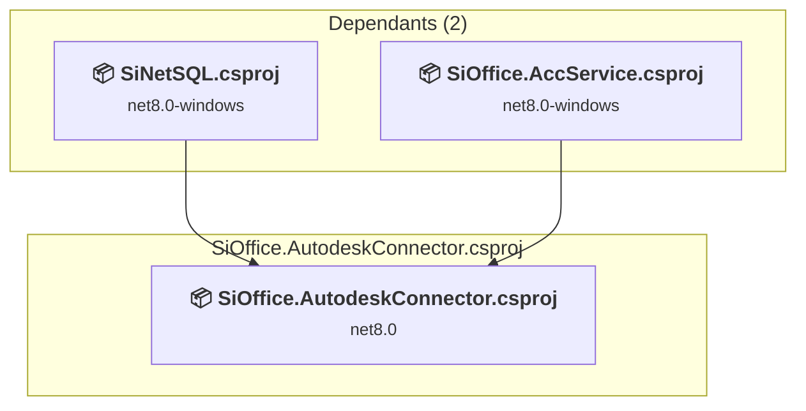

### API Compatibility

| Category | Count | Impact |
| :--- | :---: | :--- |
| 🔴 Binary Incompatible | 0 | High - Require code changes |
| 🟡 Source Incompatible | 4 | Medium - Needs re-compilation and potential conflicting API error fixing |
| 🔵 Behavioral change | 22 | Low - Behavioral changes that may require testing at runtime |
| ✅ Compatible | 6130 |  |
| ***Total APIs Analyzed*** | ***6156*** |  |

#### Project Package References

| Package | Type | Current Version | Suggested Version | Description |
| :--- | :---: | :---: | :---: | :--- |
| Newtonsoft.Json | Explicit | 13.0.4 |  | ✅Compatible |
| RestSharp | Explicit | 113.1.0 |  | ✅Compatible |

### D:\repos2026\AutodeskIntegration\SiOffice.GoogleConnector\SiOffice.GoogleConnector.csproj

#### Project Info

- **Current Target Framework:** net8.0-windows
- **Proposed Target Framework:** net10.0-windows
- **SDK-style**: True
- **Project Kind:** Wpf
- **Dependencies**: 0
- **Dependants**: 2
- **Number of Files**: 39
- **Number of Files with Incidents**: 4
- **Lines of Code**: 10765
- **Estimated LOC to modify**: 16+ (at least 0.1% of the project)

#### Dependency Graph

Legend:
📦 SDK-style project
⚙️ Classic project

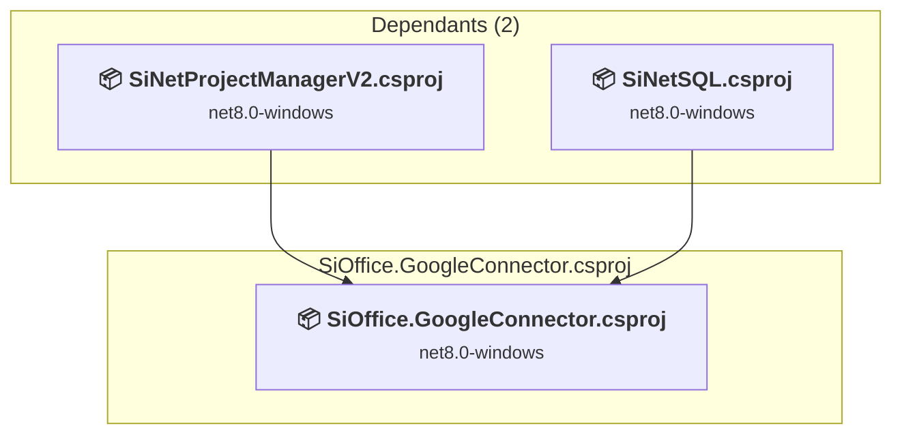

### API Compatibility

| Category | Count | Impact |
| :--- | :---: | :--- |
| 🔴 Binary Incompatible | 12 | High - Require code changes |
| 🟡 Source Incompatible | 1 | Medium - Needs re-compilation and potential conflicting API error fixing |
| 🔵 Behavioral change | 3 | Low - Behavioral changes that may require testing at runtime |
| ✅ Compatible | 10327 |  |
| ***Total APIs Analyzed*** | ***10343*** |  |

#### Project Package References

| Package | Type | Current Version | Suggested Version | Description |
| :--- | :---: | :---: | :---: | :--- |
| Dapper | Explicit | 2.1.35 |  | ✅Compatible |
| Google.Apis.Auth | Explicit | 1.73.0 |  | ✅Compatible |
| Google.Apis.Docs.v1 | Explicit | 1.73.0.4031 |  | ✅Compatible |
| Google.Apis.Drive.v3 | Explicit | 1.73.0.3996 |  | ✅Compatible |
| Google.Apis.Gmail.v1 | Explicit | 1.73.0.4029 |  | ✅Compatible |
| Google.Apis.Sheets.v4 | Explicit | 1.72.0.3966 |  | ✅Compatible |
| Microsoft.Data.SqlClient | Explicit | 5.2.2 |  | ✅Compatible |

#### Project Technologies and Features

| Technology | Issues | Percentage | Migration Path |
| :--- | :---: | :---: | :--- |
| WPF (Windows Presentation Foundation) | 12 | 75.0% | WPF APIs for building Windows desktop applications with XAML-based UI that are available in .NET on Windows. WPF provides rich desktop UI capabilities with data binding and styling. Enable Windows Desktop support: Option 1 (Recommended): Target net9.0-windows; Option 2: Add <UseWindowsDesktop>true</UseWindowsDesktop>. |

### D:\repos2026\SiNetSQL\SiNetSQL.E2ETests\SiNetSQL.E2ETests.csproj

#### Project Info

- **Current Target Framework:** net8.0-windows
- **Proposed Target Framework:** net10.0--windows
- **SDK-style**: True
- **Project Kind:** DotNetCoreApp
- **Dependencies**: 1
- **Dependants**: 0
- **Number of Files**: 18
- **Number of Files with Incidents**: 3
- **Lines of Code**: 2393
- **Estimated LOC to modify**: 2+ (at least 0.1% of the project)

#### Dependency Graph

Legend:
📦 SDK-style project
⚙️ Classic project

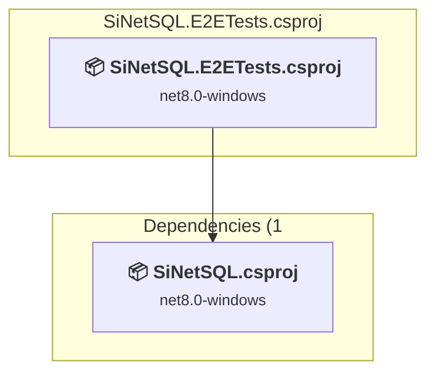

### API Compatibility

| Category | Count | Impact |
| :--- | :---: | :--- |
| 🔴 Binary Incompatible | 0 | High - Require code changes |
| 🟡 Source Incompatible | 2 | Medium - Needs re-compilation and potential conflicting API error fixing |
| 🔵 Behavioral change | 0 | Low - Behavioral changes that may require testing at runtime |
| ✅ Compatible | 2478 |  |
| ***Total APIs Analyzed*** | ***2480*** |  |

#### Project Package References

| Package | Type | Current Version | Suggested Version | Description |
| :--- | :---: | :---: | :---: | :--- |
| Google.Apis.Auth | Explicit | 1.73.0 |  | ✅Compatible |
| Google.Apis.Gmail.v1 | Explicit | 1.73.0.4029 |  | ✅Compatible |
| Microsoft.EntityFrameworkCore.SqlServer | Explicit | 8.0.12 |  | ✅Compatible |
| Microsoft.Extensions.Configuration.Binder | Explicit | 8.0.2 | 10.0.7 | NuGet package upgrade is recommended |
| Microsoft.Extensions.Configuration.Json | Explicit | 8.0.1 |  | ✅Compatible |
| Microsoft.NET.Test.Sdk | Explicit | 17.8.0 |  | ✅Compatible |
| xunit | Explicit | 2.6.6 |  | ⚠️NuGet package is deprecated |
| xunit.runner.visualstudio | Explicit | 2.5.6 |  | ✅Compatible |

### D:\repos2026\SiNetSQL\SiNetSQL.Tests\SiNetSQL.Tests.csproj

#### Project Info

- **Current Target Framework:** net8.0-windows
- **Proposed Target Framework:** net10.0-windows
- **SDK-style**: True
- **Project Kind:** Wpf
- **Dependencies**: 2
- **Dependants**: 0
- **Number of Files**: 10
- **Number of Files with Incidents**: 1
- **Lines of Code**: 1217
- **Estimated LOC to modify**: 0+ (at least 0.0% of the project)

#### Dependency Graph

Legend:
📦 SDK-style project
⚙️ Classic project

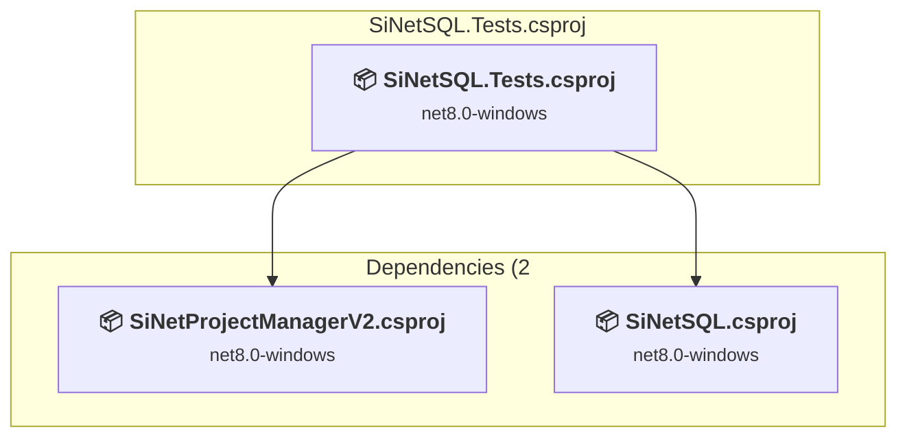

### API Compatibility

| Category | Count | Impact |
| :--- | :---: | :--- |
| 🔴 Binary Incompatible | 0 | High - Require code changes |
| 🟡 Source Incompatible | 0 | Medium - Needs re-compilation and potential conflicting API error fixing |
| 🔵 Behavioral change | 0 | Low - Behavioral changes that may require testing at runtime |
| ✅ Compatible | 1113 |  |
| ***Total APIs Analyzed*** | ***1113*** |  |

#### Project Package References

| Package | Type | Current Version | Suggested Version | Description |
| :--- | :---: | :---: | :---: | :--- |
| Microsoft.EntityFrameworkCore.InMemory | Explicit | 8.0.12 | 10.0.7 | NuGet package upgrade is recommended |
| Microsoft.NET.Test.Sdk | Explicit | 17.8.0 |  | ✅Compatible |
| xunit | Explicit | 2.6.6 |  | ✅Compatible |
| xunit.runner.visualstudio | Explicit | 2.5.6 |  | ✅Compatible |

### D:\repos2026\SiNetSQL\SiNetSQL\SiNetSQL.csproj

#### Project Info

- **Current Target Framework:** net8.0-windows
- **Proposed Target Framework:** net10.0--windows
- **SDK-style**: True
- **Project Kind:** ClassLibrary
- **Dependencies**: 2
- **Dependants**: 5
- **Number of Files**: 444
- **Number of Files with Incidents**: 38
- **Lines of Code**: 400741
- **Estimated LOC to modify**: 2748+ (at least 0.7% of the project)

#### Dependency Graph

Legend:
📦 SDK-style project
⚙️ Classic project

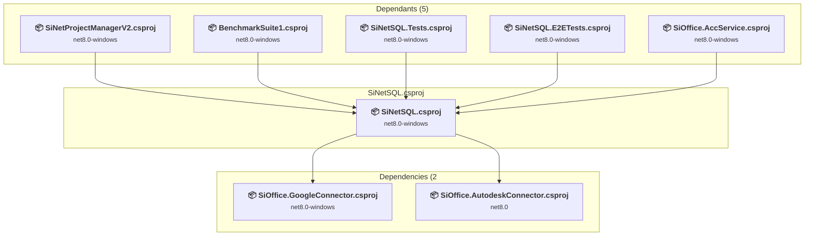

### API Compatibility

| Category | Count | Impact |
| :--- | :---: | :--- |
| 🔴 Binary Incompatible | 2691 | High - Require code changes |
| 🟡 Source Incompatible | 32 | Medium - Needs re-compilation and potential conflicting API error fixing |
| 🔵 Behavioral change | 25 | Low - Behavioral changes that may require testing at runtime |
| ✅ Compatible | 584499 |  |
| ***Total APIs Analyzed*** | ***587247*** |  |

#### Project Package References

| Package | Type | Current Version | Suggested Version | Description |
| :--- | :---: | :---: | :---: | :--- |
| Microsoft.EntityFrameworkCore | Explicit | 8.0.12 | 10.0.7 | NuGet package upgrade is recommended |
| Microsoft.EntityFrameworkCore.SqlServer | Explicit | 8.0.12 | 10.0.7 | NuGet package upgrade is recommended |
| Microsoft.EntityFrameworkCore.Tools | Explicit | 8.0.12 | 10.0.7 | NuGet package upgrade is recommended |
| Microsoft.Extensions.DependencyInjection.Abstractions | Explicit | 8.0.2 | 10.0.7 | NuGet package upgrade is recommended |
| Microsoft.Extensions.Logging.Abstractions | Explicit | 8.0.2 | 10.0.7 | NuGet package upgrade is recommended |
| Microsoft.Xaml.Behaviors.Wpf | Explicit | 1.1.135 | 1.1.39 | ⚠️NuGet package is incompatible |
| Microsoft-WindowsAPICodePack-Shell | Explicit | 1.1.5 |  | ✅Compatible |
| Serilog | Explicit | 3.1.1 |  | ✅Compatible |

#### Project Technologies and Features

| Technology | Issues | Percentage | Migration Path |
| :--- | :---: | :---: | :--- |
| Windows Forms Legacy Controls | 2 | 0.1% | Legacy Windows Forms controls that have been removed from .NET Core/5+ including StatusBar, DataGrid, ContextMenu, MainMenu, MenuItem, and ToolBar. These controls were replaced by more modern alternatives. Use ToolStrip, MenuStrip, ContextMenuStrip, and DataGridView instead. |
| Windows Forms | 5 | 0.2% | Windows Forms APIs for building Windows desktop applications with traditional Forms-based UI that are available in .NET on Windows. Enable Windows Desktop support: Option 1 (Recommended): Target net9.0-windows; Option 2: Add <UseWindowsDesktop>true</UseWindowsDesktop>; Option 3 (Legacy): Use Microsoft.NET.Sdk.WindowsDesktop SDK. |
| GDI+ / System.Drawing | 19 | 0.7% | System.Drawing APIs for 2D graphics, imaging, and printing that are available via NuGet package System.Drawing.Common. Note: Not recommended for server scenarios due to Windows dependencies; consider cross-platform alternatives like SkiaSharp or ImageSharp for new code. |
| WPF (Windows Presentation Foundation) | 622 | 22.6% | WPF APIs for building Windows desktop applications with XAML-based UI that are available in .NET on Windows. WPF provides rich desktop UI capabilities with data binding and styling. Enable Windows Desktop support: Option 1 (Recommended): Target net9.0-windows; Option 2: Add <UseWindowsDesktop>true</UseWindowsDesktop>. |

### MasterPlan.SyncEngine\MasterPlan.SyncEngine.csproj

#### Project Info

- **Current Target Framework:** net8.0
- **Proposed Target Framework:** net10.0
- **SDK-style**: True
- **Project Kind:** DotNetCoreApp
- **Dependencies**: 0
- **Dependants**: 0
- **Number of Files**: 14
- **Number of Files with Incidents**: 6
- **Lines of Code**: 8728
- **Estimated LOC to modify**: 28+ (at least 0.3% of the project)

#### Dependency Graph

Legend:
📦 SDK-style project
⚙️ Classic project

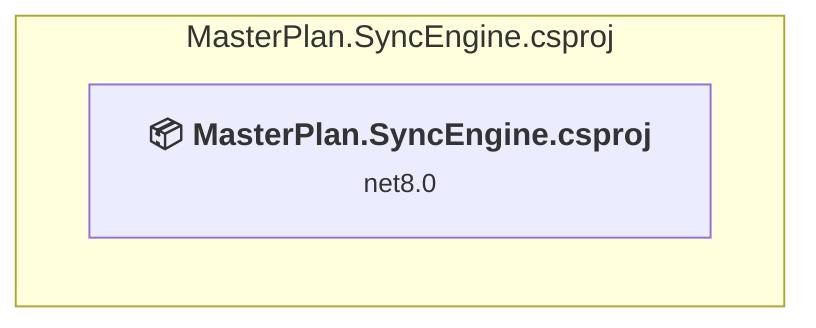

### API Compatibility

| Category | Count | Impact |
| :--- | :---: | :--- |
| 🔴 Binary Incompatible | 0 | High - Require code changes |
| 🟡 Source Incompatible | 4 | Medium - Needs re-compilation and potential conflicting API error fixing |
| 🔵 Behavioral change | 24 | Low - Behavioral changes that may require testing at runtime |
| ✅ Compatible | 9860 |  |
| ***Total APIs Analyzed*** | ***9888*** |  |

### SiMasterPlanWeb\SiMasterPlanWeb.csproj

#### Project Info

- **Current Target Framework:** net8.0
- **Proposed Target Framework:** net10.0
- **SDK-style**: True
- **Project Kind:** ClassLibrary
- **Dependencies**: 0
- **Dependants**: 0
- **Number of Files**: 1
- **Number of Files with Incidents**: 1
- **Lines of Code**: 7
- **Estimated LOC to modify**: 0+ (at least 0.0% of the project)

#### Dependency Graph

Legend:
📦 SDK-style project
⚙️ Classic project

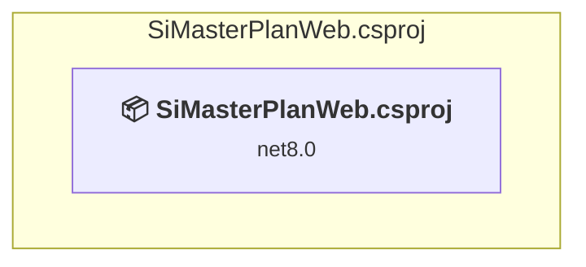

### API Compatibility

| Category | Count | Impact |
| :--- | :---: | :--- |
| 🔴 Binary Incompatible | 0 | High - Require code changes |
| 🟡 Source Incompatible | 0 | Medium - Needs re-compilation and potential conflicting API error fixing |
| 🔵 Behavioral change | 0 | Low - Behavioral changes that may require testing at runtime |
| ✅ Compatible | 0 |  |
| ***Total APIs Analyzed*** | ***0*** |  |

### SiNetProjectManagerV2\SiNetProjectManagerV2.csproj

#### Project Info

- **Current Target Framework:** net8.0-windows
- **Proposed Target Framework:** net10.0-windows
- **SDK-style**: True
- **Project Kind:** Wpf
- **Dependencies**: 2
- **Dependants**: 1
- **Number of Files**: 128
- **Number of Files with Incidents**: 1
- **Lines of Code**: 32096
- **Estimated LOC to modify**: 0+ (at least 0.0% of the project)

#### Dependency Graph

Legend:
📦 SDK-style project
⚙️ Classic project

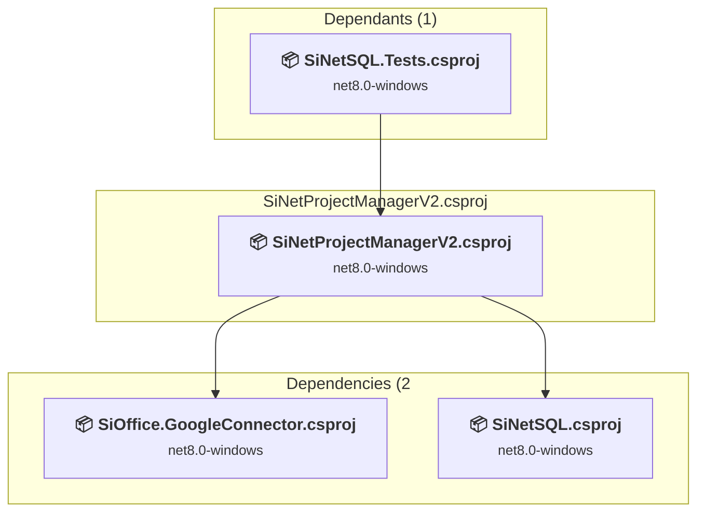

### API Compatibility

| Category | Count | Impact |
| :--- | :---: | :--- |
| 🔴 Binary Incompatible | 0 | High - Require code changes |
| 🟡 Source Incompatible | 0 | Medium - Needs re-compilation and potential conflicting API error fixing |
| 🔵 Behavioral change | 0 | Low - Behavioral changes that may require testing at runtime |
| ✅ Compatible | 0 |  |
| ***Total APIs Analyzed*** | ***0*** |  |

### SiOffice.AccService\SiOffice.AccService.csproj

#### Project Info

- **Current Target Framework:** net8.0-windows
- **Proposed Target Framework:** net10.0--windows
- **SDK-style**: True
- **Project Kind:** AspNetCore
- **Dependencies**: 2
- **Dependants**: 0
- **Number of Files**: 5
- **Number of Files with Incidents**: 2
- **Lines of Code**: 370
- **Estimated LOC to modify**: 1+ (at least 0.3% of the project)

#### Dependency Graph

Legend:
📦 SDK-style project
⚙️ Classic project

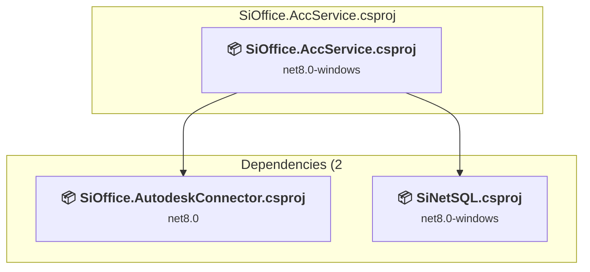

### API Compatibility

| Category | Count | Impact |
| :--- | :---: | :--- |
| 🔴 Binary Incompatible | 1 | High - Require code changes |
| 🟡 Source Incompatible | 0 | Medium - Needs re-compilation and potential conflicting API error fixing |
| 🔵 Behavioral change | 0 | Low - Behavioral changes that may require testing at runtime |
| ✅ Compatible | 432 |  |
| ***Total APIs Analyzed*** | ***433*** |  |

