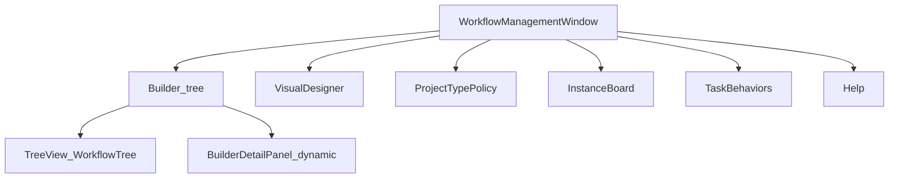

# Workflow Management Window — Inventory (before refactor)

- **Date:** 12.07.2026
- **Status:** Confirmed inventory (read-only mapping; no UI rewrite in this slice)
- **Primary surface:** `SiNetProjectManagerV2/Dialogs/WorkflowManagementWindow.xaml` (+ `.xaml.cs`)
- **Entry:** MainWindow menu → **ניהול תהליכים (מרוכז)** (admin-only)
- **Related:** `WorkflowUiScreens-2026-06-21.md`, `WorkflowPrinciples-2026-05-26.md`, seed under `SiNet.Infrastructure.Sql/Services/SeedData/`

---

## 1. Window structure (6 tabs)

| # | Tab (Hebrew) | Role | In scope for tree refactor? |
|---|--------------|------|-----------------------------|
| 1 | בונה תהליכים ומשימות | Definition tree + detail editor | **Yes — primary** |
| 2 | עורך ויזואלי | Canvas designer over same definitions | Related (shared model) |
| 3 | מדיניות פר-סוג-פרויקט | ProjectType ↔ allowed workflows / stages / disciplines | Policy only |
| 4 | לוח תהליכים | Runtime instances by project | No (instances) |
| 5 | התנהגויות משימה | Task behavior definitions | Separate |
| 6 | עזרה | In-window help | — |

Window chrome: title **ניהול תהליכי עבודה**, ~1120×720, RTL, modal `ShowDialog`.



---

## 2. Builder tab layout

```
[ Banner: בחר תהליך ← שלב ← משימה ]
┌──────────────────────┬─────────────────────────────┐
│ עץ תהליכים           │ Detail header + panel       │
│ [תהליך חדש] [רענן]   │ (fields/actions by selection)│
│ TreeView             │                             │
└──────────────────────┴─────────────────────────────┘
[ Status counts ]                         [סגור]
```

- **No ViewModel** for the builder tree — imperative code-behind (`BuildTree`, `Show*Detail`).
- Selection → dynamically built UI in `BuilderDetailPanel` (not classic XAML binding).
- Tree node tags (`WorkflowManagementWindow.xaml.cs`):

| Record | Meaning |
|--------|---------|
| `MgmtWorkflowNode` | Workflow definition |
| `MgmtStageNode` | Stage under definition |
| `MgmtTransGroupNode` | Forward or backward transition group |
| `MgmtTransitionNode` | Single transition rule |
| `MgmtTaskGroupNode` | Stage-tasks group |
| `MgmtStageTaskNode` | One stage-task template |

### Tree hierarchy (what the user sees)

| Level | Node | Display cues |
|-------|------|--------------|
| 1 | Workflow | Name + stage/transition counts; inactive marker |
| 2 | Stage | SortOrder + name; 🟢 initial / 🔴 final / 🔵 mid |
| 3a | Forward group | ➡️ קדימה (count) — `To.SortOrder > From.SortOrder` |
| 3b | Backward group | ↩️ חזרה (count) — `To.SortOrder < From.SortOrder` |
| 3c | Tasks group | 📋 משימות (count) |
| 4 | Leaf | Transition target stage, or task type → default assignee |

Data load: EF `WorkflowDefinitions` + Stages (+ StageTasks/TaskType/Assignee) + TransitionRules, ordered by `Code`, `AsNoTracking`.

---

## 3. Builder actions (what the window lets you do)

| Action | Target | Implementation notes |
|--------|--------|----------------------|
| תהליך חדש | Workflow | `BuilderAddWorkflow_Click` — `Code = WF_{timestamp}`, default name |
| רענן | Tree | `BuilderRefresh_Click` → `BuildTree()` |
| Save workflow | Workflow | Name, Description, IsActive; `Code` via `GenerateCode` from Latin name |
| Delete workflow | Workflow | Blocked when active instances exist; prefer deactivate |
| Add / save / delete stage | Stage | Stage Code also via `GenerateCode` |
| Move stage ↑↓ | Stage | Updates `SortOrder`; then `RecalculateInitialFinal` |
| Add / save / delete transition | Transition | From trans-group detail |
| Add / save / remove stage task | StageTask | TaskType, assignee, required, notes |
| Move task ↑↓ | StageTask | Updates `SortOrder` |

**Auto rules in Builder:**

- `IsInitial` = first stage by `SortOrder`; `IsFinal` = last. UI shows these as automatic, not free-form flags.
- Forward/backward grouping is **derived from SortOrder**, not a DB field.

### Visual designer tab (same window, different surface)

MVVM: `WorkflowDesignerView` + `WorkflowDesignerViewModel` (SiNetSQL).

Commands include: Add Start/End/Stage/Decision/Fork/Join/SubWorkflow; connect/delete; stage tasks; transition actions; start triggers; Save / Validate / AutoLayout.

Can edit **Codes** and canvas layout — no system-lock in UI today.

---

## 4. Data model behind the tree

```
WorkflowDefinition (Id, Code unique, Name unique, Description, IsActive)
  ├─ Stages[] (Code per def, SortOrder, IsInitial/Final, NodeType,
  │            Canvas*, Color, SubWorkflowDefinitionId?, WaitMode, Group)
  │     └─ StageTasks[] (TaskTypeId, DefaultAssigneeId?, SortOrder, IsRequired, Notes)
  ├─ TransitionRules[] (From→To, Trigger, Condition*, Priority, Label, …)
  │     └─ Actions[] (ActionType, ActionCode?, ConfigJson, SortOrder)
  └─ StartTriggers[] (TriggerSource, PropertiesJson, …)
```

- **SubWorkflow:** stage `NodeType = SubWorkflow` + `SubWorkflowDefinitionId` (no separate table).
- Persistence models: `SiNet.Infrastructure.Sql/Models` (namespace `SiNetSQL.Models`).
- Stable code constants: `SiNet.Infrastructure.Sql/Constants/WorkflowCodes.cs`, `*StageCodes.cs`.

---

## 5. Out-of-the-box defaults (seed)

Seeded by `SqlWorkflowSeedService.SeedAllAsync` (idempotent, additive):

| Order | Workflow `Code` | Stage prefix | Role |
|-------|-----------------|--------------|------|
| 1 | (user groups) | — | OfficeManagement, SeniorManagement, Planners, Review-* |
| 2 | `MaterialIntake` | `MAT.*` | Reusable material sub-workflow |
| 3 | `PlanningWorkflow` | `PLN.*` | Canonical planning |
| 4 | `Review` | `REV.*` | Plan review; hosts MaterialIntake at `REV.MaterialIntake` |
| 5 | `Proposal` | `PRP.*` | Price quote (email-driven; **not** ProjectType-mapped) |
| 6 | `Opinion` | `OPN.*` | Opinion (email-driven; **not** ProjectType-mapped) |
| 7+ | ProjectType mappings | PLN.* activation | JobType → PlanningWorkflow + stage/discipline profiles |

Seed files: `PlanningWorkflowSeedData.cs`, `ReviewWorkflowSeedData.cs`, `MaterialIntakeWorkflowSeedData.cs`, `ProposalWorkflowSeedData.cs`, `OpinionWorkflowSeedData.cs`, `ProjectTypeWorkflowStageSeedData.cs`.

**Re-seed behavior (important):**

| Artifact | On re-seed |
|----------|------------|
| Definition | Create if missing by Code; does **not** overwrite existing Name/Description |
| Stages | Add missing by Code; **update** Name, SortOrder, IsInitial/Final, groups, sub-workflow link; **does not delete** extra stages |
| Stage tasks | Add missing `(Stage, TaskType)` only — no update of existing rows |
| Transitions | Upsert by uniqueness key; does **not** delete designer-added extras |

---

## 6. What can change vs what must not

### Relatively safe at design time

- Hebrew Name / Description, `IsActive`
- Custom workflows (non-seed Codes)
- Extra stages / tasks / transitions
- Stage and task order
- Canvas layout / colors (Designer)
- ProjectType policy mappings
- Transition `ConfigJson` / attached actions (within existing action catalog)

### Dangerous / locked without coordinated code + seed

| Item | Why |
|------|-----|
| Seeded workflow/stage **`Code`** values | Hardcoded in constants, seed lookup, email/actions, tests |
| Surrogate `Id` | FKs / instances |
| Delete definition with instances | Builder blocks; deactivate instead |
| ProcessAction handler catalog | Deployed code, not admin data |
| `TaskInteractionDefinition` registry | Code registry, not DB-editable |
| Expecting seed to remove obsolete designer rows | Seed is additive |

There is **no** `IsSystem` column. “System workflow” = convention (`WorkflowCodes` + seed Codes).

### Builder vs Designer mutability nuance

| Concern | Builder | Visual Designer |
|---------|---------|-----------------|
| Code | Auto `GenerateCode` from Latin name | Editable in UI |
| IsInitial / IsFinal | Derived from SortOrder | Set explicitly with graph |
| Transitions | Simple CRUD | Full graph replace on save |
| System lock | None | None |

---

## 7. Implications for a future refactor (summary)

1. Two editors share one model (imperative tree + MVVM canvas) — decide unify vs shared service + two UIs.
2. Builder has no ViewModel — first candidate for MVVM extraction.
3. UI should treat seeded Codes as read-only “system” before any broader redesign.
4. Instance board / policy / behaviors stay out of the definition-tree refactor unless scoped in.

---

## 8. Key file index

| Path | Role |
|------|------|
| `SiNetProjectManagerV2/Dialogs/WorkflowManagementWindow.xaml(.cs)` | Admin hub + builder tree |
| `SiNetProjectManagerV2/WPFUserControl/WorkflowDesignerView.xaml(.cs)` | Visual designer host |
| `SiNetSQL/MVVM/WorkflowDesignerViewModel.cs` | Designer VM |
| `SiNet.Infrastructure.Sql/Models/*` | EF entities |
| `SiNet.Infrastructure.Sql/Constants/WorkflowCodes.cs` | Stable workflow Codes |
| `SiNet.Infrastructure.Sql/Constants/*StageCodes.cs` | Stable stage Codes |
| `SiNet.Infrastructure.Sql/Services/DevTools/SqlWorkflowSeedService.cs` | Seed runner |
| `SiNet.Infrastructure.Sql/Services/SeedData/*` | Seed graphs |

