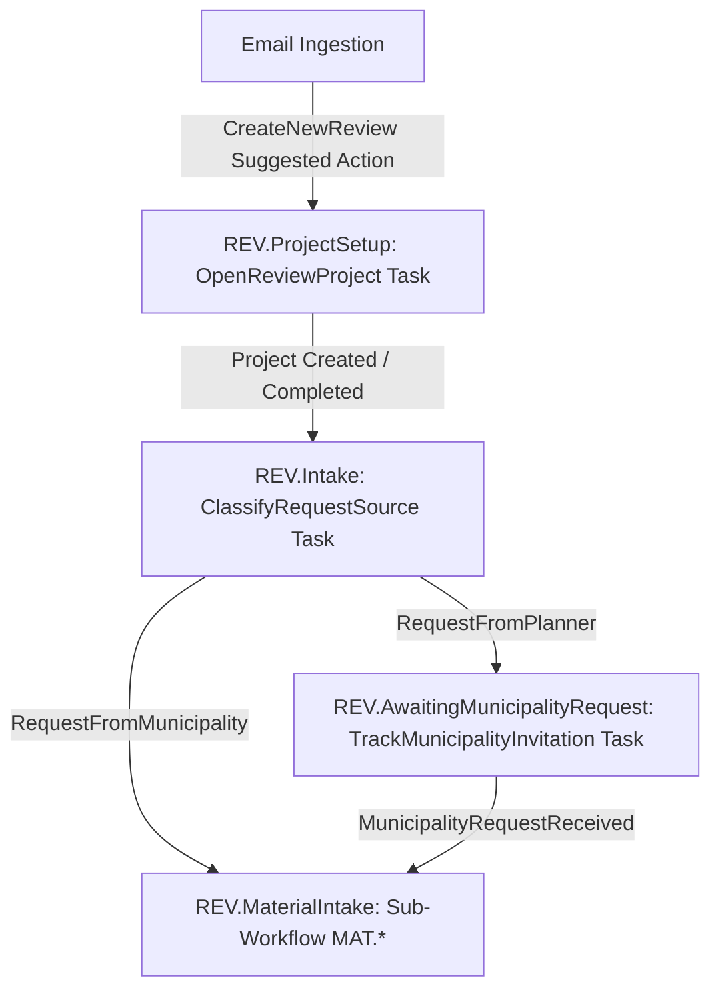

# Workflow Principles

- **Decision date / Updated date:** 26.05.2026
- **Status:** Active — source of truth for tasks, actions, and runtime workflow.
- **Scope:** Tasks, Actions, RuntimeActions, action handlers, task completion, ReviewTask, FileQuoteMaterial, workflow advance, FloatingTasks, `PRP.MaterialCheck`.

## Purpose
Define how tasks and actions move the system forward, who is responsible for what, and what must not be duplicated.

## Source of truth
- `SiNetSQL\docs\WorkflowDecisions.md` — append-only workflow decision log.
- `SiNetSQL\docs\ProjectFileFiling.md` — filing pipeline architecture and `IProcessActionHandler` dispatcher.

## Core principles
1. Tasks drive the workflow. Actions are triggered through task completion and the action handler dispatcher.
2. Workflow stages use the `PLN.*` codes (e.g. `PLN.Approval.AuthorityApproved`). `ProjectStatus` is a separate broad list — do not use `Completed` as `ProjectStatus`.
3. `ProjectStatus` values are limited to: LeadReceived, QuotePreparation, WaitingForQuoteApproval, WaitingForWorkOrder, Active, WaitingForClient, WaitingForAuthority, WaitingForMaterial, BillingPending, Closed, ClosedLost, Cancelled.
4. Design stages and disciplines depend on `ProjectType`.
5. Gmail labels are not statuses; they represent responsible assignee only.
6. Task assignment to a UserGroup:
   - 1 member → auto-assign.
   - Multiple members → use group default assignee.
   - No default → user must pick. Each group should have a default assignee setting.
   - Empty group / no default → workflow notifies the user and does not proceed without an assignee.
7. New open tasks are appended to the **end** of the queue (Max+1). Reopened tasks also go to the end. On close, clear priority and re-rank.
8. Do not invent a new handler if a suitable mechanism (e.g. an existing `IProcessActionHandler`) already exists. Extend, do not duplicate.
9. Runtime action state snapshots (e.g. `RuntimeActions-CurrentState.md`) are informational; binding decisions live in `WorkflowDecisions.md`.

## Workflow / Task / Action handler boundaries (added 26.05.2026)

This section is the authoritative split between `Workflow`, `Task`,
`Action Handler`, `RuntimeAction`, and `Completion`. It complements the
architecture rules in
[`Domains\Architecture\ArchitecturePrinciples-2026-05-26.md`](../Architecture/ArchitecturePrinciples-2026-05-26.md)
§ *Workflow vs Task* and the service map in
[`Domains\Architecture\ServiceCatalog-2026-05-26.md`](../Architecture/ServiceCatalog-2026-05-26.md).

### Workflow

- **Workflow is a long-running business process**, not a `Task`.
- Responsibilities:
  - Business **stages**.
  - **Transitions** between stages.
  - **Policy by project type**.
  - The relation between actions, tasks, and results.
  - Controlled process advancement.
- `Workflow` is **not** equivalent to `Task` and `Task` does **not**
  replace the workflow lifecycle.

### Task

- **Task is a unit of work.** It can be part of a `Workflow`, but it is
  not a workflow by itself.
- Responsibilities:
  - Who must perform the action (assignment / `UserGroup` rules).
  - What the required action is.
  - Priority / queue position (append at end on open / reopen).
  - Result of execution.
  - Closing / completion.
- Not every `Workflow` change must create a `Task`.
- Not every `Task` is a full `Workflow`.

### Action Handler

- An **Action Handler** is where a business action is actually executed.
- Examples: `MoveToProject`, `FileQuoteMaterial`, `ReviewTask`,
  `AddMaterialToProject`, `TaskCompletion`, `RuntimeAction`-related
  operations.
- When a business action runs, it **must** go through the agreed
  dispatcher / handler. If `IProcessActionHandler` (or an equivalent
  existing dispatcher) already covers the case, **use it or extend it**.
- Do **not** create a new ad-hoc action chain when a suitable handler /
  dispatcher already exists.

### RuntimeAction

- `RuntimeAction` is an **action description / action state / available
  action**, not a parallel workflow engine.
- `RuntimeAction` must **not** create a new path that bypasses:
  - `Workflow`,
  - `Task`,
  - `Action Handler`,
  - `Completion` service.
- If a matching handler already exists for the action, use it or extend
  it; do not introduce a parallel `RuntimeAction`-only execution path.

### Completion

- Task completion / action completion is **not** just a status change.
- A completion must:
  - **Record the result.**
  - **Invoke the handler** when required.
  - **Update workflow** when required.
  - **Surface failure to the user** when execution fails.
  - **Log the failure.**
  - **Never hide a failure behind a fallback.**

### UI / ViewModel boundary

- A `ViewModel` **does not close a workflow by itself**.
- A `ViewModel` **does not decide alone** whether to move a workflow
  stage.
- A `ViewModel` **does not directly execute** actions such as
  `MoveToProject`, `ReviewTask`, `FileQuoteMaterial`,
  `AddMaterialToProject`, `TaskCompletion`.
- A `ViewModel` calls a **Service / Dispatcher / Handler / Use Case**
  and surfaces the result to the user.

### Forbidden across these boundaries

- Creating a parallel action flow.
- Closing a `Task` without going through the agreed completion / service
  / handler path.
- Changing a workflow stage directly from the UI.
- Using `ProjectStatus` as a `WorkflowStage`.
- Using `RuntimeAction` as an additional workflow engine.
- Adding a fallback that marks success even though a handler failed.
- Creating a new handler before checking whether an existing handler can
  be extended.
- Running `PlanReview` as a silent side effect of file filing instead of
  via the agreed `Task` / `Workflow` / `Action Handler` path (see
  [`Domains\PlanReview\PlanReviewPrinciples-2026-05-26.md`](../PlanReview/PlanReviewPrinciples-2026-05-26.md)).
- Treating `Inspection` / `Review` as a stand-alone workflow engine.
- Letting `AI` approve, reject, close a `Task`, advance a `Workflow`
  stage, or write business state on its own (see
  [`Domains\AI\AiSystemPrinciples-2026-05-26.md`](../AI/AiSystemPrinciples-2026-05-26.md)).

## What we do not do now
- Do not bypass the action handler dispatcher for new actions.
- Do not change workflow designer or migrations as part of documentation work.
- Do not represent statuses via Gmail labels.
- Do not close a `Task` without going through the agreed completion / service / handler path.
- Do not change a workflow stage directly from the UI / `ViewModel`.
- Do not use `ProjectStatus` as a `WorkflowStage`.
- Do not use `RuntimeAction` as a parallel workflow engine.
- Do not add a fallback that reports success while the handler failed.
- Do not create a new handler before checking whether an existing handler can be extended.

## Dropped / cancelled / postponed
- `Completed` as a `ProjectStatus` value — dropped.
- Parallel ad-hoc handler chains — dropped.
- Parallel action flow outside the agreed dispatcher — **not approved**.
- Direct `Task` closure that bypasses the agreed completion / service / handler path — **not approved**.
- Direct workflow stage changes from the UI / `ViewModel` — **not approved**.
- `ProjectStatus` used as a `WorkflowStage` — **not approved**.
- `RuntimeAction` as an additional workflow engine — **not approved**.
- Fallback that signals success despite a failed handler — **not approved**.
- `Inspection` / `Review` as a stand-alone workflow engine — **not approved**.
- `PlanReview` as a silent side effect of file filing — **not approved**.
- `AI` as an autonomous decision maker inside workflow — **not approved**.
- `AI` auto-approve / auto-reject / auto-complete / auto-advance — **not approved**.
- Deep per-handler documentation — postponed.

## Relevant terms / search terms
Task, Action, RuntimeAction, IProcessActionHandler, MoveToProject, AddMaterialToProject, ReviewTask, FileQuoteMaterial, FloatingTask, PRP.MaterialCheck, WorkflowStageDefinition, PLN.Approval.AuthorityApproved, ProjectStatus, UserGroup, default assignee, Workflow vs Task, Action Handler boundary, Completion boundary, RuntimeAction boundary, ViewModel boundary, dispatcher, handler extension.

## Relevant code areas (informational)
- `SiNetSQL\SiNetSQL\Domain\Actions\Handlers`
- `IProcessActionHandler` implementations
- `WorkflowDecisions.md`

## Extracted from archived documents (Round C, 26.05.2026)

Sources (archived): `Action-Task-Workflow.md`, `Typed-Continuation-Design.md`, `ProjectWork-Documentation.md`.

### Typed continuation paths — no legacy fallback
- Migrated continuation actions (TaskCreation, FileImport) run on a **typed-only path**: application service → `IActionContinuationUiHost` → typed dialog → typed result → application service `ContinueAsync`. No `RequiresUI(...)` enum fallback.
- Continuation requests and results are **typed models**, not an open `enum + props` bag.
- The UI host is abstracted (e.g. `IActionContinuationUiHost`); ViewModels do not bind to dialogs directly.
- Missing data, validation failure, or inability to open UI must **fail visibly** (clear error + log). No silent fallback.
- Legacy paths still physically present (e.g. `AssignActionDialog`, `EmailManagementView.CreateActionTaskAsync` for migrated actions) are **not active** and are candidates for removal.

### Project work and workflow boundary
- `WorkflowManagementWindow` is the single management surface for the workflow engine (Builder, Visual Designer, Policy, Dashboard, Behaviors, Help). No parallel Builder/Policy windows.
- The ProjectWork screen **does not** change `ProjectStatus` or `WorkflowStage` directly; such changes go only through workflow actions / engine transitions.

## WPF Component Routing, Floating Task Completion, and Virtual Association (added 12.06.2026)

### WPF Component Routing
- Every workflow task component key (e.g., `InspectionReport`, `ManagerReviewApproval`, `PoliceSubmission`, `MaterialChecklist`) must map to a dedicated UI routing or view in `FloatingProjectTasksView.xaml.cs`.
- Fallback/default UI behavior must not silence unmapped tasks; any unmapped component key should be explicitly handled or raise an appropriate developer alert/logging if triggered.

### Floating Task Completion
- Floating tasks (e.g. email intake, files verification) require explicit completion signals rather than implicit background closure.
- For tasks like email filing, the task completes when the user initiates a transition action (e.g., "Move to Project" or a dedicated "Finish Task" button).
- The completion system must guarantee task state persistence and invoke the workflow engine transition.

### Association for Planner Requests
[Modified 2026-06-15 — Dropped Virtual Association]
Child project creation (REV.ProjectSetup) is now always the first stage of the workflow, meaning the target child project folder structures in ACC are immediately available regardless of the request source. Emails and files are always physically filed directly into the child project without requiring virtual association or deferred filing.

- For planner-initiated requests starting at `REV.AwaitingMunicipalityRequest`, files/emails are virtually linked to the parent project since no child project directory exists yet.
- When the invitation is received, the child project is created (`REV.ProjectSetup`), at which point the virtual association is promoted to a physical association.
- The system must retroactively file any virtually associated files/emails into the newly created child project directory.

# Architectural Decisions — SiNetSQL Workflow Runtime

This document describes the design, principles, and runtime contracts of the SiNetSQL workflow engine. It is maintained as a single, cohesive explanation of the current system design, with inline annotations showing where and when specific design decisions were modified.

---

## 1. Core Workflow Design Principles

### Continuous Task Chain
[Added 2026-06-15 — Continuous Task Chain Principle]
Every task initiated by a workflow or a suggested action must have a defined successor or transition. A project/workflow must never have zero open tasks unless it has reached a terminal (final) state. If a stage transition or task completion does not immediately produce a domain task (due to waiting for external events or documents), a dedicated tracking/follow-up task (such as `TrackMunicipalityInvitation`) must be active, ensuring the process is never "lost" or without an owner.

---

## 2. Workflow Entry and Project Association

### Unified Workflow Initiation
[Modified 2026-06-15 — Immediate Workflow Initiation]
Every process started from a suggested action on an email must immediately initiate a workflow. The system does not create standalone tasks outside of workflows.
For the **Review (בדיקת תוכנית)** workflow, all starts (whether planner-initiated or municipality-initiated) begin by starting the `Review` workflow on the parent project:
1. The suggested action **"בדיקה חדשה" (New Review)** (`CreateNewReview`) starts the `Review` workflow immediately on the parent project.
2. The initial stage is **`REV.ProjectSetup` (פתיחת פרויקט בדיקה)**.

### Stage Sequencing and Classification Flow
[Modified 2026-06-15 — Reordered Project Setup and Intake Classification]
To ensure order and clarity, the project is always created at the very beginning of the flow, followed by the intake classification. The sequence of stages is:

1. **REV.ProjectSetup (פתיחת פרויקט בדיקה)**:
   * **Task**: `OpenReviewProject` (פתיחת בדיקה חדשה).
   * **Action**: User opens this task and creates the child project.
   * **Transition**: Completion of `OpenReviewProject` (result `ProjectOpened`) automatically transitions the workflow to `REV.Intake`.

2. **REV.Intake (קליטת בקשה לבדיקה)**:
   * **Task**: `ClassifyRequestSource` (סיווג מקור הפנייה).
   * **Action**: In this stage, the user classifies whether they need to wait for the official invitation.
   * **Transition**:
     * Result `RequestFromPlanner` (needs invitation) transitions the workflow to `REV.AwaitingMunicipalityRequest`.
     * Result `RequestFromMunicipality` (official invitation exists) transitions the workflow to `REV.MaterialIntake`.

3. **REV.AwaitingMunicipalityRequest (המתנה לפנייה רשמית מהרשות)**:
   * **Task**: `TrackMunicipalityInvitation` (מעקב פנייה מהרשות).
   * **Action**: Tracks receipt of the official invitation.
   * **Transition**: Result `MunicipalityRequestReceived` transitions the workflow to `REV.MaterialIntake`.

---

## 3. Sub-Workflows and Nesting

### Parent/Child Nesting via Persisted Links
[Added 2026-05-23]
Parent workflows (Planning, Review) delegate work to reusable child workflows (such as `MaterialIntake`) and resume when the child completes. This relationship is modeled via explicit, persisted links:
* `WorkflowInstance.ParentWorkflowInstanceId` (nullable `int`, self-referencing foreign key).
* Navigation properties `ParentWorkflowInstance` and `ChildWorkflowInstances` in EF Core.

### Nesting Runtime Contract
1. **Sub-Workflow Startup**: `StartSubWorkflowProcessActionHandler` calls `WorkflowEngine.StartAsync(..., parentWorkflowInstanceId: parentInstance.Id)`.
2. **Auto-Advance on Child Completion**: When a child workflow reaches a completed state, `WorkflowTaskOrchestrator.AdvanceWithTasksAsync` automatically triggers `NotifyParentOfSubWorkflowCompletionAsync` to find the parent, evaluate transition rules (trigger type `SubWorkflowCompleted`), and auto-advance the parent.
3. **Task Provisioning Avoidance**: `WorkflowTaskOrchestrator.CreateStageTasksAsync` returns an empty list when the stage's `NodeType == "SubWorkflow"`. The child workflow owns the active tasks; the parent stage must not materialize its own tasks.

