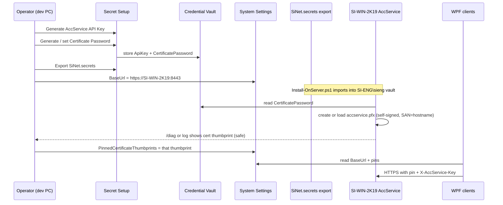

# AccService TLS (self-signed) via existing Secret Setup / Settings

> Status: **Implemented** (2026-07-28)  
> Decision: no purchased CA certificate; self-signed everywhere; lifecycle through the
> existing Credential Vault + Secret Setup + System Settings (no parallel secrets system).
>
> Approvals (2026-07-28):
> 1. Production auto-PFX when vault password is present and Store/Path are empty — **yes**.
> 2. Pin storage: semicolon-separated System Setting — **yes**.
> 3. Certificate Password UI — **native Secret Setup only** (no Legacy SecretSetupWindow).

## Goal

One operator path for AccService HTTPS — identical in local Development and on
`SI-WIN-2K19`:

1. Secrets live only in Windows Credential Manager (`SiNet/...`), managed by Secret Setup.
2. Non-secret trust config (BaseUrl, thumbprint pins) lives in System Settings / host config.
3. AccService never invents passwords or pins; it only consumes vault + optional store/path.
4. Export → `SiNet.secrets` → `Install-OnServer.ps1` remains the only server provisioning path.

## Separation of concerns (unchanged principle)

| Kind | Where it lives | Why |
| --- | --- | --- |
| Shared API key | Vault `SiNet/AccService/ApiKey` | Secret shared by clients and service |
| PFX password | Vault `SiNet/AccService/CertificatePassword` | Secret that protects the local PFX |
| AccService Base URL | System Setting `AccService.BaseUrl` (already exists) | Not a secret |
| TLS thumbprint pin(s) | System Setting `AccService.PinnedCertificateThumbprints` (**new**) | Trust pin, not a secret — must be readable without vault unlock on every client |

Do **not** store thumbprints in the vault. Pins are trust metadata; putting them in the vault
would force every workstation through secret import just to accept the office AccService.

## Target end-to-end flow

### Development (this machine, today)

Same vault keys. AccService starts under the interactive user:

1. Secret Setup → ensure `ApiKey` + `CertificatePassword` are green.
2. AccService `appsettings.Development.json` (or host config) enables the self-signed PFX path
   when Store/Path are empty and the vault password is present.
3. Loopback clients may accept chain errors without a pin (existing TLS policy).
4. Non-loopback clients need the pin in System Settings once the PFX exists.

### Server (final state, still self-signed — no purchase)

1. Dev PC: Generate/rotate secrets in Secret Setup → Export `SiNet.secrets`.
2. Server: existing `Install-OnServer.ps1` imports into `SI-ENG\sieng` vault
   (must include the new CertificatePassword once it is in `SecretCatalog.All` / `SecretKeys.All`).
3. AccService service account reads the password, creates/loads `accservice.pfx` next to the exe
   (or a configured Path). No bought cert.
4. Operator copies the presented thumbprint (from AccService startup log / `/diag` safe fields /
   Secret Setup Test) into System Setting `AccService.PinnedCertificateThumbprints`.
5. Clients already reading `AccService.BaseUrl` from Settings also read the pins from Settings.

## AccService certificate resolution (target)

Keep fail-closed. Preferred order becomes:

1. **Windows store** — `Certificate:StoreName` + `Thumbprint` (optional escape hatch).
2. **Explicit PFX path** — `Certificate:Path` + vault password.
3. **Vault-backed self-signed** — if `CertificatePassword` is in the vault and Store/Path are
   empty: load or create `accservice.pfx` beside the exe (today gated only by
   `AllowSelfSignedDevCert=true`; target: same behavior whenever the vault password is present
   and no store/path is configured, so Production on the office server does not depend on a
   "Dev" flag).
4. Otherwise — refuse to start (current exception).

`AllowSelfSignedDevCert` remains as an explicit opt-in override for machines that intentionally
want auto-PFX without going through Settings, but the **supported** path is vault password.

## Secret Setup UI (target)

Extend the existing AccService row group (do not add a second screen):

| Control | Behavior |
| --- | --- |
| AccService API Key | Already: Generate / Test / status strip |
| AccService Certificate Password (**new**) | Generate (random) or paste; Save to vault; included in Export |
| Test AccService | Uses BaseUrl + pins from host Settings; after TLS is up, reports safe thumbprint so the operator can paste into Settings |

Native Test must pass pins (parity with legacy) so a self-signed remote host is testable.

## System Settings (target)

| Key | Shape |
| --- | --- |
| `AccService.BaseUrl` | already managed |
| `AccService.PinnedCertificateThumbprints` | new — semicolon- or JSON-array of normalized hex thumbprints; empty = rely on CA-valid or loopback only |

`AccServiceControlPlaneConfiguration.Bind` reads pins from host `IConfiguration`, which already
surfaces System Settings for AccService BaseUrl — same channel for pins.

## Explicit non-goals

- Buying or installing a public CA certificate.
- A second vault, second export format, or TLS-only setup wizard.
- Storing the PFX bytes in the vault (file stays on the AccService machine; only the password
  is a secret).
- Rewriting Git history or changing the MSI install account model.

## Files that will change after approval (preview)

- Docs: this file (approved), `SECRETS-MANAGEMENT.md`, `SiOffice.AccService/DEPLOYMENT.md`,
  `docs/ACC_CONTROL_PLANE.md`
- Catalog: `SecretCatalog` + SiNetSQL `SecretKeys.All` + SyncEngine `CredentialProvider` mirror
- UI: native (+ legacy if still used) Secret Setup row for Certificate Password
- AccService: TLS resolution uses vault password without requiring a "Dev" flag when Store/Path empty
- Settings: new `AccService.PinnedCertificateThumbprints` key + Settings UI field next to BaseUrl
- Tests: catalog count, export includes new key, TLS wiring with pin from Settings

## Decisions (locked)

1. **Production auto-PFX:** vault password + empty Store/Path ⇒ load/create `accservice.pfx`
   (same path on Dev and SI-WIN-2K19). `AllowSelfSignedDevCert` may remain as a redundant
   explicit opt-in but is no longer required for the supported flow.
2. **Pin storage:** one System Setting `AccService.PinnedCertificateThumbprints`, values
   separated by `;`.
3. **UI:** Certificate Password only on native Secret Setup. Legacy `SecretSetupWindow` is
   left unchanged (still deprecated for the New System path).
