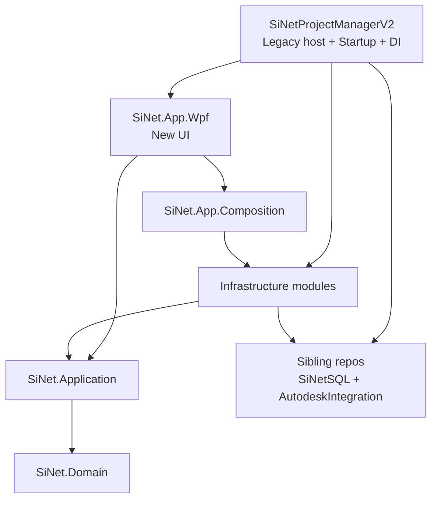

# SI Net Project Manager V2 — Architecture, Migration, Data and Production Readiness Audit

**Title:** SI Net Project Manager V2 — Architecture, Migration, Data and Production Readiness Audit  
**Date:** 2026-07-27  
**Status:** Final audit report — read-only review  
**Scope:** danny-isr/SiNetProjectManager, branch SiWorkNet10, commit 2fb132901901dd5b7146830dbd8857a5a56dc88d; הפרויקט הראשי SiNetProjectManagerV2; פרויקטי src/SiNet.*; SiOffice.AccService; MasterPlan.SyncEngine; ושלושת קובצי ה־SQL שסופקו.

## 1. מסקנה מנהלית

כיוון הארכיטקטורה נכון: הריפוזיטורי עובר ממערכת WPF מונוליטית ומבוססת שירותים סטטיים למבנה מודולרי עם Domain, שכבת Application המבוססת Ports/DTOs, מודולי Infrastructure נפרדים, Composition Root ו־WPF חדש. עקרון ה־Workflow-first מוגדר היטב, ובחלקים מרכזיים גם נאכף בפועל.

עם זאת, המצב הנוכחי הוא עדיין מערכת היברידית בתהליך Strangler, ולא Clean Architecture שהושלמה. SiNetProjectManagerV2 עדיין משמש Host ראשי, מחזיק Startup ו־DI גדולים, מכיר בו־זמנית את המערכת הישנה והחדשה, ותלוי בריפוזיטוריז אחים שאינם כלולים ב־clone. בנוסף נמצאו פערי אבטחה, שחזור סכימה ו־Production Readiness שמונעים מתן אישור ייצור חדש על בסיס הבדיקה הנוכחית.

**החלטה מומלצת:**
- להמשיך עם אסטרטגיית Workflow-first; אין סיבה להחליף אותה.
- לא להכריז עדיין על סיום ההמרה או על Production Ready.
- לעצור קידום נוסף לייצור עד סגירת ארבעה שערים: סודות ו־ACC security, סכימת DB ניתנת לשחזור, build נקי ואוטומטי, והתאמת מסמכי המוכנות לתפריט Release בפועל.

## 2. תמונת מצב

| נושא | מצב | הערכה |
| --- | --- | --- |
| כיוון ארכיטקטוני | ירוק | היעד ברור ועקרונות הליבה נכונים |
| הפרדת UI / Application | צהוב | קיימת ברוב הזרימות, אך יש חריגות ישירות ל־Infrastructure ו־code-behind עסקי |
| Composition ו־Startup | אדום | שני מסלולי Composition ו־Host ישן מונוליטי |
| Workflow / Task backbone | ירוק־צהוב | הגבולות הנכונים קיימים; עדיין יש Debug/Host seams ישירים |
| השלמת ההמרה | צהוב | מספר מודולים הועברו, אך ה־Host וה־runtime עדיין היברידיים |
| סכימת נתונים ושחזור | אדום | קובצי ה־SQL אינם תואמים לסכימה הנוכחית |
| אבטחת סודות ו־ACC | אדום | נמצא secret tracked ומדיניות TLS/diagnostics חלשה |
| בדיקות | צהוב | כיסוי סטטי רחב; לא ניתן היה להריץ את הבדיקות בסביבה הנוכחית |
| Build נקי ו־CI | אדום | חסרות תלויות חיצוניות ואין GitHub Actions |
| מוכנות לייצור | אדום | מסמך ה־pilot ישן וסותר את קוד Release הנוכחי; smoke ידני עדיין לא מתועד כ־Pass |

## 3. מבנה הריפוזיטורי

בריפוזיטורי קיימים 20 קובצי csproj. קיימים שני Solutions בעלי מטרות שונות:

- **SiNet.sln** — ה־solution של הארכיטקטורה החדשה: SiNet.Domain, SiNet.Application, מודולי Infrastructure, SiNet.LegacyBridge, SiNet.App.Composition ו־SiNet.App.Wpf.
- **SiNetProjectManager.sln** — solution רחב והיברידי: SiNetProjectManagerV2, השירותים והכלים, המודולים החדשים, פרויקטי בדיקות, וגם פרויקטים מריפוזיטוריז אחים.

ה־Solutions אינם מייצגים כרגע Build Contract אחד:

- SiNet.sln אינו כולל את שלושת פרויקטי הבדיקות החדשים.
- SiNetProjectManager.sln כולל תלויות חיצוניות שאינן נמצאות בריפוזיטורי.
- אין global.json, אין Central Package Management ואין lock files.
- אין `.github/workflows`; לכן אין gate אוטומטי שמוכיח build/tests בכל commit.

### 3.1 הארכיטקטורה בפועל

התרשים ממחיש שהמערכת החדשה קיימת ופועלת, אך עדיין אינה Host עצמאי לחלוטין. ה־V2 הוא Composition Root חלופי וגם Adapter לשירותים הישנים.

## 4. מה בנוי נכון

### 4.1 עקרונות ומסמכי מקור אמת

`docs/ARCHITECTURE_TARGET.md`, `docs/MIGRATION_MAP.md`, `docs/NEW_SYSTEM_BOUNDARY.md` ומסמכי ה־Source of Truth של Email/ACC מגדירים עקרונות טובים:

- Workflow הוא process backbone.
- השלמת Task עוברת דרך `ITaskCompletionService`/coordinator ולא דרך שינוי מצב ישיר ב־ViewModel.
- WPF אמור לצרוך Ports של Application, לא EF entities ולא ספקים חיצוניים.
- Gmail label הוא מקור האמת ל־mailbox filing; ACC הוא מקור האמת למסמכים הפיזיים; DB הוא helper/cache.
- שימוש ב־`IDbContextFactory<>` ובהקשרים קצרים מתאים ל־WPF.
- EF migrations מוגדרים immutable.

### 4.2 גבולות שמתקיימים בפועל

- לא נמצאו טיפוסי WPF בשכבות Domain, Application, Infrastructure או LegacyBridge.
- לא נמצאה מוטציה ישירה של WorkflowStage, WorkflowStatus או ProjectStatus מתוך SiNet.App.Wpf.
- משטחי Email, Inspection, ProjectWork ו־Task Workbench משתמשים ברובם ב־`ITaskNavigationService` וב־`ITaskCompletionService`.
- SiNet.App.Wpf אינו מפנה ישירות לפרויקט SiNetSQL או ל־SiNetProjectManagerV2.
- שכבת Application רחבה: כ־280 קובצי C# עם Ports, DTOs ו־orchestrators.
- קיימת הפרדה למודולי SQL, Google, Autodesk, FileSystem, Logging ו־Secrets.
- מנגנוני ACC API key נכשלים סגור כאשר אין מפתח, וההשוואה מבוצעת בזמן קבוע.
- מנגנון ה־Sync כולל watermarks ו־run history — בסיס טוב להתאוששות ולתצפית.

### 4.3 השקעה בבדיקות

בקריאת source נמצאו:

- 1,079 הצהרות `[Fact]`/`[Theory]` ב־SiNet.App.Wpf.Tests.
- 69 ב־SiNet.Infrastructure.Google.Tests.
- 15 ב־SiNet.LegacyBridge.Tests.
- 30 קובצי Boundary tests לפי שם/תיקייה.
- לא נמצאו בדיקות מסומנות Skip.

זה בסיס רחב וחיובי. עם זאת, הספירה אינה תחליף להרצה בפועל, ואין כרגע evidence עדכני שהן עוברות ב־HEAD שנבדק.

## 5. פערים ארכיטקטוניים

### 5.1 שכבת Domain עדיין דקה מאוד

SiNet.Domain כולל שמונה קבצים בלבד. לעומתו, SiNet.Infrastructure.Sql כולל מאות קבצים, Context מלא עם 89 DbSet&lt;&gt;, וקוד Workflow/Task/Email משמעותי.

המשמעות אינה שה־Domain “שגוי”, אלא שהמערכת עדיין בעיקר Application + Data model, ולא Domain model עשיר. יש להמשיך להעביר רק invariants יציבים — לא לבצע העתקה מכנית של כל entity ל־Domain.

### 5.2 הפרת dependency rule בין מודולי Infrastructure

`src/SiNet.Infrastructure.Autodesk` מפנה ישירות ל־`SiNet.Infrastructure.Sql`. זה סותר את הכלל המתועד שלפיו מודולי Infrastructure אינם תלויים זה בזה.

### 5.3 UI מכיר Infrastructure

SiNet.App.Wpf מפנה ישירות ל־SiNet.Infrastructure.Secrets. בנוסף:

- `NewShellFactory.cs` מייבא `SiNet.Infrastructure.Sql.Services.Workflow` כדי להפעיל `StalledWorkflowWatchdog`.
- `DevToolsCoordinator.cs` מייבא Microsoft.EntityFrameworkCore כדי לתפוס `DbUpdateException`.

### 5.4 שני Composition Roots בעלי התנהגות שונה

קיימים שני מסלולים: `SiNet.App.Wpf/App.xaml.cs` קורא `AddSiNet(...)`, ו־`SiNetProjectManagerV2/App.xaml.cs` בונה גרף אחר ומוסיף את `AddSiNetNewSystemGraph()`. בנוסף, `AddSiNet()` רושם תמיד `AddSiNetLegacyBridge()`.

### 5.5 ה־Host הישן עדיין מונוליטי

`SiNetProjectManagerV2/App.xaml.cs` גדול; במסלול `RunNewSystemStartup` מופעלות עדיין פונקציות Startup ישנות שפותחות Legacy windows. במסלול New System מדולג ValidateDatabaseSchema.

### 5.6 Async נחסם באופן סינכרוני

נמצאו מספר `GetAwaiter().GetResult()` ב־Startup וב־NewShellFactory.

### 5.7 ViewModels ו־code-behind גדולים

דוגמאות: InspectionWindowViewModel (~1748), SettingsViewModel (~1546), ProjectWorkTreeViewModel (~1313), ועוד. `OpenQuoteProjectDecisionDialog.xaml.cs` מבצע orchestration עסקית ב־code-behind.

## 6. מצב ההמרה

### 6.1 מה כבר הומר

בסיס Workflow read/write Ports ו־Task completion backbone; Gmail native foundation; ACC control-plane Ports; EF model/migrations ב־Infrastructure.Sql; Settings/Users/Permissions; משטחי Email, ProjectWork, Task Workbench, Inspection ו־Workflow viewer.

### 6.2 מה עדיין היברידי

V2 Host/Composition; Google runtime חלקי; ACC provisioning תלוי connector חיצוני; Identity partly legacy; FileSystem לא הושלם; LegacyBridge כברירת מחדל; namespaces `SiNetSQL.*` בתוך Infrastructure.Sql.

### 6.3 מסמכי מוכנות אינם תואמים לקוד

`docs/NEW_SYSTEM_PRODUCTION_READINESS.md` (2026-07-05) סותר את תפריט Release בפועל ב־HEAD 2026-07-27. יש לעדכן ולהריץ smoke חדש.

## 7. Build, שחזור ו־CI

ה־clone אינו self-contained (sibling refs ל־SiNetSQL / AutodeskIntegration). `MasterPlan.SyncEngine.csproj` מכיל mojibake ענק. אין CI. אין CPM.

## 8. ביקורת שלושת קובצי ה־SQL

- `01-scriptSiEng.sql` אינו סכימה נוכחית (~35 טבלאות מול ~85 במודל).
- `03-scriptReplica.sql` מפגר (חסרים MP_TimeHourReports, MP_ProjectHoursExtended).
- AUTO_CLOSE ON; Replica ללא FKs דורש reconciliation.
- Race במנעול Sync_Lock (stale lock ללא owner token).

## 9. אבטחה

- Secret tracked: `MasterPlan.SyncEngine/appsettings.json` עם ApiKey.
- AccService: ListenAnyIP, PFX password קשיח, `/diag` ללא auth.
- Client TLS validation רחב מדי (`.si-eng.local`, `192.168.`).

## 10. סדר פעולות מומלץ

ראה תוכנית המימוש בשלבים (S0–S7): P0 secrets/ACC → readiness/DB freeze → CI → Composition HostMode → infra/UI ports → sync lock/build hygiene → P2 debt.

## 11. Definition of Done מומלץ לכל Slice

Slice ייחשב מומר רק כאשר:

1. SiNet.App.Wpf צורך Application Ports/DTOs בלבד.
2. אין פתיחה של legacy Window ואין תלות ישירה ב־legacy service.
3. ה־registration קיים ב־Composition יחיד.
4. כל I/O הוא async עם cancellation וללא sync-over-async.
5. קיימות unit tests, boundary tests ולפי הצורך integration tests.
6. נבדקה תאימות schema/migration ללא עריכת migrations היסטוריים.
7. תפריט Release, permissions ומסמכי readiness תואמים בפועל.
8. בוצע smoke ידני מתועד עבור DB, Vault, Gmail ו־ACC.
9. הנתיב הישן הוסר, או מתועד במפורש כ־remaining owner עם תאריך retirement.

## 12–16. החלטות, אימות, Out of Scope

- Workflow-first: להמשיך.
- Strangler דרך V2: זמני עם תאריך יציאה.
- SiNet.sln: solution רשמי של המערכת החדשה + בדיקות.
- LegacyBridge: opt-in ל־V2Hybrid בלבד.
- Database baseline: backup/baseline עדכני + migration history מוכח.
- ACC: Service-side privilege, API מאומת ותעודה מהימנה/pinned.
- Domain: להרחיב לפי invariants, לא לפי טבלאות.
- Generic repositories / MediatR: אין צורך.

**אימות:** סקירה read-only בלבד; לא שונה קוד בזמן הביקורת; Build/tests: Not Run בסביבת הביקורת המקורית.

**Out of scope:** הרצה אינטראקטיבית מלאה, חיבור חי ל־DB/Gmail/ACC, סקירת sibling repos מלאה, load/pen test, מימוש תיקונים (בוצע בסבב מימוש נפרד אחרי אישור התוכנית).

## מקורות מרכזיים

- `docs/ARCHITECTURE_TARGET.md`
- `docs/MIGRATION_MAP.md`
- `docs/NEW_SYSTEM_BOUNDARY.md`
- `docs/NEW_SYSTEM_PRODUCTION_READINESS.md`
- `SECRETS-MANAGEMENT.md`
- `SiNetProjectManagerV2/App.xaml.cs`
- `src/SiNet.App.Composition/SiNetCompositionExtensions.cs`
- `src/SiNet.App.Wpf/Shell/NewShellFactory.cs`
- `SiOffice.AccService/*`
- `MasterPlan.SyncEngine/*`
- `src/SiNet.Infrastructure.Sql/Migrations/SiNetSQLDbContextModelSnapshot.cs`
