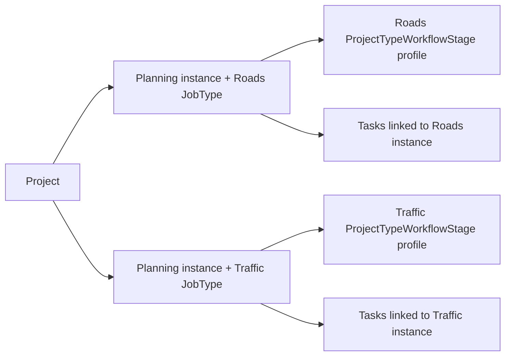

# ProjectType ↔ Workflow — track-instance policy and post-approval continuation

- **Date:** 2026-08-01
- **Status:** Runtime slice in progress — migration applied; continuation/nav/reuse/stage-policy/UI wired to B2 tracks
- **Scope:** Project-bound continuation workflows started after Proposal approval, their JobType track identity, stage policy, task ownership, navigation, dashboard projection, and project-level status aggregation
- **Related:** [Workflow Principles](../../SiNetProjectManagerV2/Docs/Domains/Workflow/WorkflowPrinciples-2026-05-26.md), [Proposal workflow manual test](./PROPOSAL_WORKFLOW_MANUAL_TEST.md) §2.8, table `ProjectTypeWorkflowDefinition`

## 1. Approved product decision

The target architecture is **B2: one `WorkflowInstance` per project track / `JobType`**.

For a project containing Roads and Traffic, approval starts two independent Planning instances even when both JobTypes map to the same `WorkflowDefinition`:



Each track advances, pauses, completes, and owns tasks independently. Completing one track must not advance, complete, cancel, or reuse work from another track.

The unit of parallelism is the **project JobType track**, not an individual task. “Workflow per task” is explicitly rejected.

B1 (separate definitions such as `PlanningRoads` and `PlanningTraffic`) is not the architectural target. It may be proposed only as a documented temporary bridge if a later implementation assessment proves that B2 cannot be delivered safely in one slice.

## 2. Existing mechanism — current code truth

The current runtime remains in force until the B2 model/runtime slice is implemented:

1. Every active JobType must have at least one enabled mapping to an active `WorkflowDefinition` through `ProjectTypeWorkflowDefinition`.
2. After `QuoteApprovedByClient`, `SqlProjectTypeContinuationStarter` resolves each project JobType’s default mapping and deduplicates by `WorkflowDefinitionId`.
3. Therefore, two JobTypes that both map to `PlanningWorkflow` currently produce one shared Planning instance.
4. `ProjectTypeWorkflowStage` rows exist in seed/configuration but are not yet the enforced runtime stage path.
5. `WorkflowInstance` has no explicit JobType track identity.
6. Task navigation and dashboard projections contain project-level fallbacks that may select or collapse to a “best” / newest open instance rather than the exact instance linked to a task.

The current behavior is a known gap, not the approved target. Documentation must not describe the present dedupe-by-definition behavior as B2-compliant.

## 3. Target instance identity and active uniqueness

A project-bound track instance must carry explicit JobType identity. The model slice should use `WorkflowInstance.JobTypeId` or an equivalent reviewed FK to the project’s JobType assignment.

The logical active identity is:

```text
ProjectId + WorkflowDefinitionId + JobTypeId
```

Rules:

- At most one `Active` or `Paused` instance may exist for the same logical identity.
- Multiple historical terminal instances for the same identity are allowed.
- New JobType-driven continuation instances must have non-null track identity.
- Project-level or non-JobType workflows may remain unbound (`JobTypeId = null`) when their documented business scope is the whole project.
- Persistence must enforce active uniqueness through a filtered unique constraint or an equivalent concurrency-safe mechanism approved during the model review. An application-only pre-check is not sufficient as the sole concurrency protection.

## 4. Post-approval continuation

After `QuoteApprovedByClient`:

1. Enumerate the active JobTypes assigned to the quote project.
2. Resolve the selected/default enabled workflow mapping for each JobType.
3. For every JobType mapping, start a separate project-bound instance and populate its JobType identity.
4. Skip startup only when an `Active` or `Paused` instance already exists for the same `ProjectId + WorkflowDefinitionId + JobTypeId`.
5. Two JobTypes mapping to the same definition must still produce two instances.
6. If a project JobType lacks an enabled mapping, block completion with a visible Hebrew configuration error.
7. Reject and cancel/no-response paths do not start continuation tracks.

Continuation dedupe by `WorkflowDefinitionId` alone is superseded as a target rule.

## 5. Runtime stage policy

For a JobType-bound instance, `ProjectTypeWorkflowStage` is the source of truth for the stages enabled for that track.

- Provisioning and advance must evaluate the stage profile using the instance’s JobType identity.
- A stage disabled for the JobType must not provision tasks and must not become the active stage for that instance.
- Missing or invalid stage policy for a required track is a configuration error and must fail visibly; there is no silent fallback to a generic path.
- The workflow definition remains the process template; the JobType stage profile selects the runtime path for the specific track.

## 6. Tasks, links, navigation, and reuse

- A task is a unit of work inside an instance; it is not a workflow instance.
- Operational ownership is resolved from the task’s `TaskLink` with role `Trigger` to the exact `WorkflowInstance`.
- The `Stage:{id}` tag is supporting metadata, not the primary workflow-instance identity.
- Navigation must not select the newest/open instance by project when an exact Trigger link exists.
- Open-task reuse must include the linked `WorkflowInstanceId` (or equivalent track identity). Tasks must never be shared across different track instances merely because project, assignee, and task type match.
- “Sibling tasks” means existing tasks linked to the same instance, not every possible `WorkflowStageTask` template.

## 7. Dashboard and UI projection

Project and operations views must represent all relevant project tracks instead of collapsing them to one “best” instance.

Task surfaces should display:

- workflow definition/process name;
- JobType track name;
- current stage/status of the linked instance;
- optionally, existing sibling tasks from the same instance.

The projection must be derived from the task’s exact Trigger-linked instance.

## 8. Project-level status policy

`WorkflowInstance.Status` and current stage are the source of truth for each track. `ProjectStatus` remains a coarse project-level state and must not be treated as the stage/status of one selected track.

Rules:

1. Completing one track changes only that instance; it does not complete or close the project and does not alter sibling instances.
2. A project must remain non-terminal while any required track is `Active` or `Paused`.
3. The project is eligible for a terminal `Closed` state only after all required non-cancelled track instances are terminal and any separate project-level/billing gates are satisfied.
4. No “newest instance wins” or single-track status derivation is allowed.
5. The initial B2 slice must not invent a detailed cross-track waiting-state precedence. Existing explicit project-level actions may continue to set coarse non-terminal status, while dashboards show the exact per-track states.

## 9. Existing instances, null policy, and backfill

The schema target should keep the JobType FK nullable for compatibility with historical rows and genuinely project-level workflows.

Backfill policy:

- Automatically assign a JobType only when the existing project/definition pair has exactly one deterministic mapped JobType candidate.
- Do not guess when multiple JobTypes map to the same definition. Ambiguous rows remain null and must be reported for explicit operator resolution.
- Before enabling active uniqueness for new B2 instances, the implementation plan must identify conflicting active legacy rows and define their resolution.
- No automatic migration or database update is run by an agent. The user owns migration generation and application.

## 10. Required implementation order and approval gates

1. **Docs-first:** this document and Workflow Principles become the approved source of truth. ✅
2. **Approval checkpoint:** stop for explicit user approval of the updated documentation. ✅ (2026-08-01)
3. **Model only:** update entity and EF configuration; do not create/edit/run files under `**/Migrations/**`. ✅
4. **User-owned migration:** `WorkflowInstance_JobTypeTrack` applied. ✅
5. **Runtime:** continuation, stage enforcement, task reuse, navigation, dashboard, and tests. ✅ (initial B2 wiring)
6. **UI:** process + JobType track identity on task cards / TaskHeader. ✅ (sibling-task list optional follow-up)


## 11. Future manual checks

- [ ] Roads + Traffic mapped to the same `PlanningWorkflow` produce two active instances with different JobType identity.
- [ ] Advancing or completing Traffic does not advance or complete Roads.
- [ ] Re-running continuation does not duplicate an active/paused instance for the same triple.
- [ ] Missing workflow mapping blocks approval with a visible Hebrew error.
- [ ] Missing/invalid `ProjectTypeWorkflowStage` policy fails visibly.
- [ ] A task navigates to its Trigger-linked instance even when a newer sibling track exists.
- [ ] An open task is not reused across different instances.
- [ ] Dashboard shows every active track and does not collapse to one instance.
- [ ] Completing one track does not close the project while another required track remains open.
- [ ] Legacy ambiguous null-track rows are reported and not guessed.

## Out of Scope

This documentation-first round does not change entities, EF configuration, continuation/runtime code, stage provisioning, task reuse, navigation, dashboards, UI, tests, seed data, database state, or migration files.

## Dropped / Cancelled / Postponed

- **Dropped:** Workflow instance per individual task.
- **Dropped as target:** B1 / separate workflow definitions per JobType.
- **Postponed:** B2 schema and runtime implementation until this documentation receives explicit approval.
- **Postponed:** Migration generation and database update; both remain user-owned actions.
