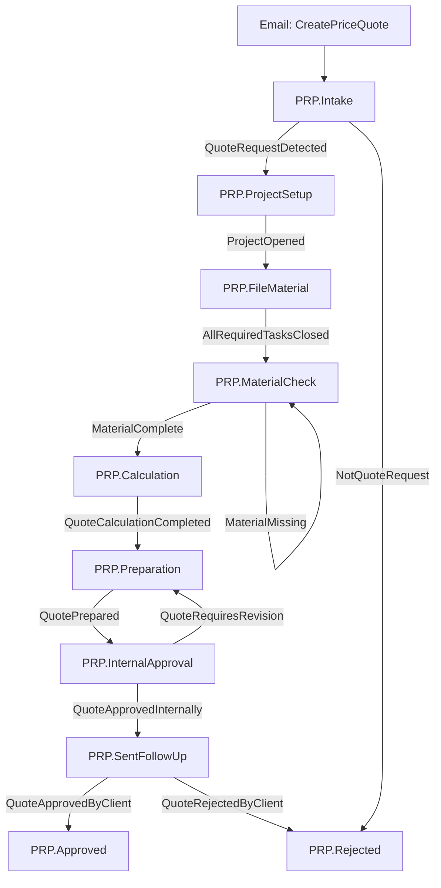

# Proposal Workflow — Manual Test Runbook (native engine)

> **TEMP / DEBUG-PHASE DOCUMENT.** This runbook drives a manual, end-to-end pass over the full native
> **Proposal (PRP.\*)** workflow tree plus the **Task Integrity** feature (delete-guard / deactivate /
> reactivate / watchdog). It relies on temporary `[WF-STEP]` instrumentation.
>
> ### Removal (after the manual pass)
> All instrumentation is marked with the comment `// TEMP WF-DEBUG`. To remove or silence it:
> - **Silence at runtime:** set the environment variable `SINET_WF_DEBUG=0` before launching the app.
> - **Remove entirely:** delete every line/section tagged `TEMP WF-DEBUG`
>   (`git grep -n "TEMP WF-DEBUG"`), including:
>   - `src/SiNet.Application/Diagnostics/WorkflowDebugTrace.cs` (whole file),
>   - the `WorkflowDebugTrace.Step(...)` calls in the engine, task, email, launcher and reporter,
>   - the **"כלי פיתוח — הרץ Watchdog עכשיו"** dev-tools menu item + `RunWatchdogNow` in `NewShellFactory`,
>   - this document.
> No schema/migration changes were made; production logging (Serilog / `LoggingEnabled`) is untouched.

---

## 0. What the tree looks like

Node reference (stage code → task type → result code that advances it → project status set):

| # | Stage (`code`) | Task type | Advancing result | On advance sets project status |
|---|---|---|---|---|
| 1 | `PRP.Intake` | `IdentifyQuoteRequest` | `QuoteRequestDetected` | `LeadReceived` |
| — | `PRP.Intake` (branch) | `IdentifyQuoteRequest` | `NotQuoteRequest` | `ClosedLost` → **PRP.Rejected** |
| 2 | `PRP.ProjectSetup` | `OpenQuoteProject` | `ProjectOpened` | `QuotePreparation` |
| 3 | `PRP.FileMaterial` | `FileQuoteMaterial` | *(none — closes on `AllRequiredTasksClosed`)* | — |
| 4 | `PRP.MaterialCheck` | `CheckQuoteMaterialCompleteness` | `MaterialComplete` | — |
| — | `PRP.MaterialCheck` (loop) | `CheckQuoteMaterialCompleteness` | `MaterialMissing` | stays in `PRP.MaterialCheck` |
| 5 | `PRP.Calculation` | `PrepareQuoteCalculation` | `QuoteCalculationCompleted` | — |
| 6 | `PRP.Preparation` | `PrepareQuoteDocument` | `QuotePrepared` | — |
| 7 | `PRP.InternalApproval` | `ApproveQuoteInternal` | `QuoteApprovedInternally` | `WaitingForQuoteApproval` |
| — | `PRP.InternalApproval` (revise) | `ApproveQuoteInternal` | `QuoteRequiresRevision` | back to `PRP.Preparation` |
| 8 | `PRP.SentFollowUp` | `FollowQuoteApproval` | `QuoteApprovedByClient` | `WaitingForWorkOrder` → **PRP.Approved** |
| — | `PRP.SentFollowUp` (branch) | `FollowQuoteApproval` | `QuoteRejectedByClient` | `ClosedLost` → **PRP.Rejected** |

All PRP transitions run in **`Auto`** mode, so closing a stage's task auto-advances the workflow in the
same operation (no confirmation dialog). `PRP.Approved` and `PRP.Rejected` are **terminal**
(`IsFinal = true`), so reaching either completes the instance (`WorkflowStatus.Completed`).

---

## 1. Setup

1. **Run the standalone New System** (`SiNet.App.Wpf.exe`). Prefer a **DEBUG** build (dev-tools menu and
   `[WF-STEP]` default on in DEBUG; in RELEASE set `SINET_WF_DEBUG=1` before launch).
   V2 New System mode remains a fallback only — production pilot host is standalone.
2. **Seed the Proposal workflow:** menu **"כלי פיתוח — טעינת Seed בסיסי"** (Task static + mappings +
   workflow seed). This seeds the PRP.\* definition, stages, transitions and stage-task templates.
   - Make sure every PRP stage's assigned group (`OfficeManagement`, `SeniorManagement`, `Planners`) has
     at least one **active member with a default assignee**, otherwise `Start`/`Advance` preflight throws
     a user-facing error (look for `WorkflowStartPreflightException` / `WorkflowAdvancePreflightException`).
3. **Have one unassigned inbox email** available in the New System inbox (an email with the office-default
   project) so the **CreatePriceQuote** suggested action is offered.
4. **Log file:** all `[WF-STEP]` lines are appended to a dedicated file via `WorkflowDebugTrace`:
   - Path: `%LocalAppData%\<AssemblyCompany>\<EntryAssemblyName>\Logs\workflow-manual-debug.log`
   - Standalone with company **שיא חדש בע״מ**:  
     `%LocalAppData%\שיא חדש בע״מ\SiNet.App.Wpf\Logs\workflow-manual-debug.log`
   - Confirm the live path in the **"הרץ Watchdog עכשיו"** dialog (`WorkflowDebugTrace.FilePath`).
   - Master gate + all trees: [`STANDALONE_WORKFLOW_PRODUCTION_GATE.md`](./STANDALONE_WORKFLOW_PRODUCTION_GATE.md)
   - Each line format: `[WF-STEP] {utcTimestamp} T{threadId} {area} | {details}`.
5. **Tip:** clear/rename the log between runs so each pass is clean.

> **How to read the checklist:** for each node do the **Action**, then verify the **Expected `[WF-STEP]`
> logs** appear (in order) and the **Expected DB state** holds. Tick `[ ]` and note anything off in
> *Result/Notes*.

---

## 2. Happy path — Start → all 8 stages → PRP.Approved

### 2.0 — Start + intake (email `CreatePriceQuote`) — **skips second classification UI**

- **Precondition:** unassigned inbox email selected; Proposal seeded.
- **Action:** in the email's suggested actions, click **"פתיחת הצעת מחיר"** (`CreatePriceQuote`).
  This action **already means** “yes, this is a quote request” — intake is auto-completed with
  `QuoteRequestDetected` (no separate classification dialog). Use **"לא בקשת הצעת מחיר"**
  (`RejectPriceQuote`) on the same email pane to close as not-a-quote.
- **Expected UI message:** process advanced to `PRP.ProjectSetup`; next task is OpenQuoteProject.
- **Expected `[WF-STEP]` logs:**
  - `Email.Action | action=CreatePriceQuote …`
  - `Email.StartWorkflow | … → starting` (+ optional `materialized inbox row`)
  - `Engine.Start | … initialStage=PRP.Intake …`
  - `Provisioning.TaskCreated | …` / `Provisioning.Stage | … tasksCreated=1`
  - `Email.StartWorkflow | … auto-complete intake task=<T1> result=QuoteRequestDetected`
  - `TaskCompletion.* | … result=QuoteRequestDetected …`
  - `Engine.Advance | … → 'PRP.ProjectSetup' …`
  - `Provisioning.Stage | …` (OpenQuoteProject task)
- **Expected DB state:** `CurrentStage=PRP.ProjectSetup`; Intake task `Completed`; new
  `OpenQuoteProject` task open; project status = `LeadReceived`.
- **Idempotency:** click `CreatePriceQuote` again on the same email → `DUPLICATE-GUARD` — no new instance.
- `[ ]` **Result/Notes:** ________________________________________________

### 2.1 — *(merged into 2.0)* Intake auto-advance

- Covered by 2.0. Manual classification dialog remains only for leftover open `IdentifyQuoteRequest`
  tasks from older runs.
- `[ ]` **Result/Notes:** ________________________________________________

### 2.2 — `PRP.ProjectSetup` → `PRP.FileMaterial`  (`ProjectOpened`)

- **Action:** complete the `OpenQuoteProject` task so it records **`ProjectOpened`** (opening the quote
  project). 
- **Expected `[WF-STEP]` logs:** `TaskCompletion.Closure … result=…` → `Evaluator.Rule … json={"TaskResultCode":"ProjectOpened"} met=True` → `Engine.Advance | … → 'PRP.FileMaterial' …` → `Provisioning.Stage … tasksCreated=1`.
- **Expected DB state:** `CurrentStage=PRP.FileMaterial`; new `FileQuoteMaterial` task open; project status
  = `QuotePreparation`.
- `[ ]` **Result/Notes:** ________________________________________________

### 2.3 — `PRP.FileMaterial` → `PRP.MaterialCheck`  (`AllRequiredTasksClosed`)

- **Note:** this stage closes via the file-filing pipeline (`ReviewMaterialFiled`), **not** a picked result
  code. The transition fires on `AllRequiredTasksClosed`.
- **Action:** file material against the `FileQuoteMaterial` task until it closes (email filing /
  MoveToProject, or complete via the ProjectWork surface if that is how the task is exposed).
- **Expected `[WF-STEP]` logs:**
  - `TaskCompletion.Closure | task=<T3> … taskClosed=True …`
  - `Evaluator.Rule | instance=<I> trigger=AllRequiredTasksClosed rule=<r> (stage <file>→<matcheck>) cond=AllTasksComplete json=(none) met=True`
  - `Engine.Advance | … → 'PRP.MaterialCheck' …`
- **Expected DB state:** `CurrentStage=PRP.MaterialCheck`; new `CheckQuoteMaterialCompleteness` task open.
- `[ ]` **Result/Notes:** ________________________________________________

### 2.4 — `PRP.MaterialCheck` → `PRP.Calculation`  (`MaterialComplete`)

- **Action:** complete `CheckQuoteMaterialCompleteness` with result **`MaterialComplete`**.
- **Expected `[WF-STEP]` logs:** `Evaluator.Rule … json={"TaskResultCode":"MaterialComplete"} met=True` → `Engine.Advance | … → 'PRP.Calculation' …`.
- **Expected DB state:** `CurrentStage=PRP.Calculation`; new `PrepareQuoteCalculation` task open.
- `[ ]` **Result/Notes:** ________________________________________________

### 2.5 — `PRP.Calculation` → `PRP.Preparation`  (`QuoteCalculationCompleted`)

- **Action:** complete `PrepareQuoteCalculation` with result **`QuoteCalculationCompleted`**.
- **Expected DB state:** `CurrentStage=PRP.Preparation`; new `PrepareQuoteDocument` task open.
- `[ ]` **Result/Notes:** ________________________________________________

### 2.6 — `PRP.Preparation` → `PRP.InternalApproval`  (`QuotePrepared`)

- **Action:** complete `PrepareQuoteDocument` with result **`QuotePrepared`**.
- **Expected DB state:** `CurrentStage=PRP.InternalApproval`; new `ApproveQuoteInternal` task open.
- `[ ]` **Result/Notes:** ________________________________________________

### 2.7 — `PRP.InternalApproval` → `PRP.SentFollowUp`  (`QuoteApprovedInternally`)

- **Action:** complete `ApproveQuoteInternal` with result **`QuoteApprovedInternally`**.
- **Expected DB state:** `CurrentStage=PRP.SentFollowUp`; new `FollowQuoteApproval` task open; project
  status = `WaitingForQuoteApproval`.
- `[ ]` **Result/Notes:** ________________________________________________

### 2.8 — `PRP.SentFollowUp` → `PRP.Approved`  (`QuoteApprovedByClient`)  **[terminal]**

- **Action:** complete `FollowQuoteApproval` with result **`QuoteApprovedByClient`**.
- **Expected `[WF-STEP]` logs:** `Engine.Advance | … → 'PRP.Approved' isFinal=True status=Completed`.
- **Expected DB state:** `CurrentStage=PRP.Approved`; instance `status=Completed`, `CompletedAtUtc` set;
  project status = `WaitingForWorkOrder`; **no new task** created for the terminal stage.
- `[ ]` **Result/Notes:** ________________________________________________

---

## 3. Branch cases

Run each from a **fresh** Proposal instance (start again via `CreatePriceQuote` on a new/other email).

### 3.A — Intake `NotQuoteRequest` → `PRP.Rejected`  **[terminal]**

- **Action:** at `PRP.Intake`, complete `IdentifyQuoteRequest` with result **`NotQuoteRequest`**.
- **Expected `[WF-STEP]` logs:** `Evaluator.Rule … json={"TaskResultCode":"NotQuoteRequest"} met=True` → `Engine.Advance | … → 'PRP.Rejected' isFinal=True status=Completed`.
- **Expected DB state:** instance `Completed` at `PRP.Rejected`; project status = `ClosedLost`.
- `[ ]` **Result/Notes:** ________________________________________________

### 3.B — MaterialCheck `MaterialMissing` self-loop

- **Precondition:** advance a fresh instance to `PRP.MaterialCheck` (repeat 2.0→2.3).
- **Action:** complete `CheckQuoteMaterialCompleteness` with result **`MaterialMissing`**.
- **Expected `[WF-STEP]` logs:** `Evaluator.Rule | … (stage <matcheck>→<matcheck>) … json={"TaskResultCode":"MaterialMissing"} met=True` → `Engine.Advance | instance=<I> stage=<matcheck> → <matcheck> 'PRP.MaterialCheck' isFinal=False status=Active` → `Provisioning.Stage | … tasksCreated=1` (a fresh check task).
- **Expected DB state:** `CurrentStage` stays `PRP.MaterialCheck`; a **new** `CheckQuoteMaterialCompleteness`
  task is open; instance still `Active`.
- `[ ]` **Result/Notes:** ________________________________________________

### 3.C — InternalApproval `QuoteRequiresRevision` → back to `PRP.Preparation`

- **Precondition:** advance a fresh instance to `PRP.InternalApproval`.
- **Action:** complete `ApproveQuoteInternal` with result **`QuoteRequiresRevision`**.
- **Expected `[WF-STEP]` logs:** `Evaluator.Rule … (stage <approval>→<prep>) … json={"TaskResultCode":"QuoteRequiresRevision"} met=True` → `Engine.Advance | … → 'PRP.Preparation' …`.
- **Expected DB state:** `CurrentStage=PRP.Preparation`; new `PrepareQuoteDocument` task open; instance
  `Active`.
- `[ ]` **Result/Notes:** ________________________________________________

### 3.D — SentFollowUp `QuoteRejectedByClient` → `PRP.Rejected`  **[terminal]**

- **Precondition:** advance a fresh instance to `PRP.SentFollowUp`.
- **Action:** complete `FollowQuoteApproval` with result **`QuoteRejectedByClient`**.
- **Expected `[WF-STEP]` logs:** `Engine.Advance | … → 'PRP.Rejected' isFinal=True status=Completed`.
- **Expected DB state:** instance `Completed` at `PRP.Rejected`; project status = `ClosedLost`.
- `[ ]` **Result/Notes:** ________________________________________________

---

## 4. Task Integrity feature (delete-guard / deactivate / reactivate / watchdog)

Use a fresh Proposal instance stopped at any active stage with **one open trigger task** (e.g. stop at
`PRP.Intake` after 2.0). Perform these from the **Task Workbench** (`ניהול משימות`).

### 4.1 — Hard delete is blocked

- **Action:** select the workflow-driving task and click **"מחק משימה"**.
- **Expected `[WF-STEP]` logs:** `Workbench.DeleteGuard | task=<T> BLOCKED — drives workflow instance(s) [<I>]`.
- **Expected UI/DB:** delete is refused (`BlockedByWorkflow`); a dialog offers to **deactivate** instead.
  The task and its `TaskLink`s are still present; the workflow is still `Active`.
- `[ ]` **Result/Notes:** ________________________________________________

### 4.2 — Deactivate (pauses workflow, cancels task, preserves link)

- **Action:** accept the "deactivate instead" offer, or click **"השבת משימה"**.
- **Expected `[WF-STEP]` logs (in order):**
  - `Workbench.Deactivate | task=<T> activeDrivenInstances=[<I>]`
  - `Workbench.Deactivate | task=<T> pausing instance=<I>`
  - `Engine.Pause | instance=<I> → status=Paused (stage=…)`
  - `Workbench.Deactivate | task=<T> → status=Cancelled; pausedInstances=[<I>]`
- **Expected DB state:** workflow `status=Paused`; task `status=Cancelled` and removed from the queue
  (`WorkPriority=null`); the Trigger `TaskLink` is **preserved**.
- `[ ]` **Result/Notes:** ________________________________________________

### 4.3 — Watchdog does NOT flag the paused workflow (no duplicate)

- **Action:** run menu **"כלי פיתוח — הרץ Watchdog עכשיו"**.
- **Expected `[WF-STEP]` logs:** `Watchdog.DevTrigger | user=<uid> detectedStalled=0 recovered=0`
  (the paused instance is **not** scanned — detection is `Active`-only). Result dialog shows
  *זוהו תקועים: 0 / שוחזרו: 0*.
- **Expected DB state:** unchanged — no new task, no new instance, still `Paused`.
- `[ ]` **Result/Notes:** ________________________________________________

### 4.4 — Reactivate (resumes workflow, reopens task)

- **Action:** select the deactivated task and click **"הפעל מחדש"**.
- **Expected `[WF-STEP]` logs (in order):**
  - `Workbench.Reactivate | task=<T> → status=Open; resumingInstances=[<I>]`
  - `Engine.Resume | instance=<I> → status=Active (stage=…)`
- **Expected DB state:** task `status=Open` and back in the queue; workflow `status=Active` at the same
  stage it paused in.
- `[ ]` **Result/Notes:** ________________________________________________

### 4.5 — Complete after reactivate → auto-advance resumes

- **Action:** complete the now-reopened task with its normal advancing result (e.g. Intake →
  `QuoteRequestDetected`).
- **Expected `[WF-STEP]` logs:** normal completion chain (`TaskCompletion.Closure … willAutoAdvance=True` →
  `Evaluator.Rule … met=True` → `Engine.Advance | … → next stage`).
- **Expected DB state:** workflow advanced to the next stage as in the happy path — deactivation left no
  scar.
- `[ ]` **Result/Notes:** ________________________________________________

### 4.6 (optional) — Watchdog recovers a genuinely stalled workflow

- **Setup:** to simulate a missed auto-advance, close a stage trigger task directly in the DB (set status
  to a closed status) **without** going through `SqlTaskCompletionService`, leaving the `Active` workflow
  with all trigger tasks closed.
- **Action:** run **"הרץ Watchdog עכשיו"**.
- **Expected `[WF-STEP]` logs:** `Watchdog.DevTrigger | … detectedStalled>=1 recovered>=…`; if a matching
  transition exists you should also see `Orchestrator`/`Engine.Advance` lines as it advances. If nothing
  can advance, look for the `Watchdog`/orphan warning in the standard log and a structured
  `workflow-orphaned` notification (via `INotificationDeliveryService`).
- `[ ]` **Result/Notes:** ________________________________________________

---

## 5. Sign-off

- [ ] Happy path (2.0–2.8) reached `PRP.Approved` (Completed).
- [ ] Branches 3.A / 3.B / 3.C / 3.D behaved as specified.
- [ ] Integrity 4.1–4.5 behaved as specified.
- [ ] `workflow-manual-debug.log` contains the expected `[WF-STEP]` lines for every step above.
- [ ] Instrumentation removed or silenced (see **Removal** note at the top) once the pass is complete.

**Tester:** ______________  **Build/commit:** ______________  **Date:** ______________
