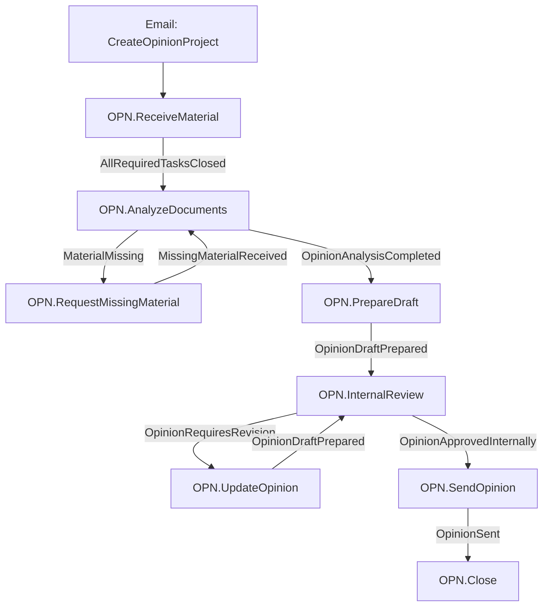
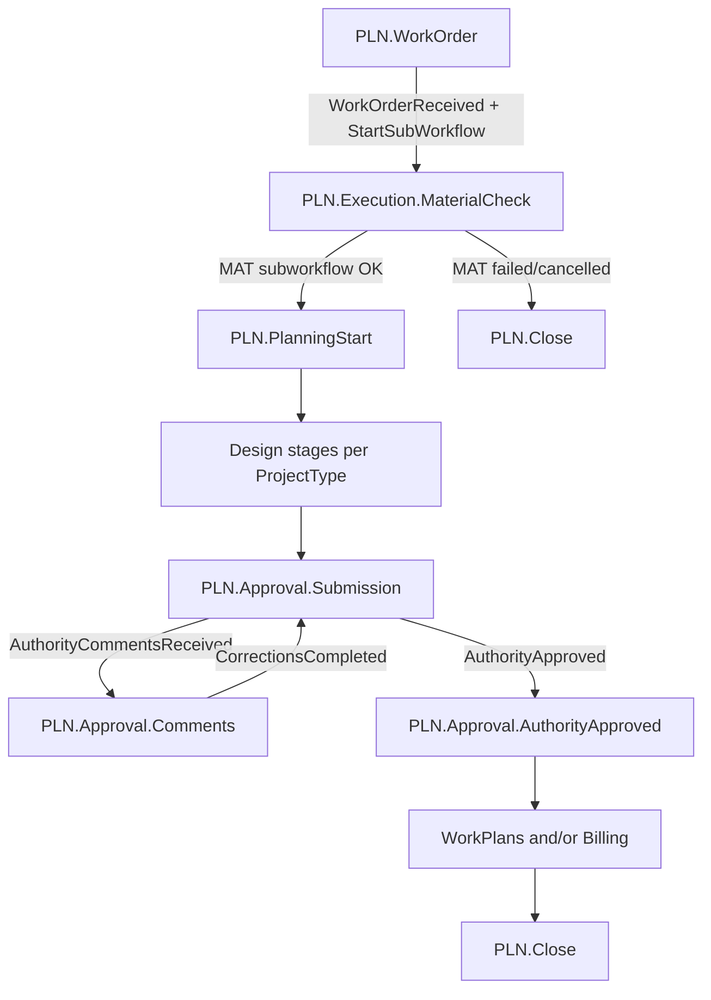

# Standalone Workflow — Production Gate (interactive + automated)

> **Host:** `SiNet.App.Wpf.exe` (standalone DEBUG for `[WF-STEP]`; Release for production menu checks)  
> **Date opened:** 2026-07-30  
> **Related:** [`PROPOSAL_WORKFLOW_MANUAL_TEST.md`](./PROPOSAL_WORKFLOW_MANUAL_TEST.md),
> [`NEW_SYSTEM_PRODUCTION_READINESS.md`](../NEW_SYSTEM_PRODUCTION_READINESS.md),
> [`WORK_SURFACE_WORKFLOW_INTEGRATION.md`](../WORK_SURFACE_WORKFLOW_INTEGRATION.md),
> seed inventory in `SiNetProjectManagerV2/Docs/Domains/Workflow/WorkflowManagementWindow-Inventory-2026-07-12.md`

## 0. Protocol (operator + agent)

1. Operator performs UI **Action** (email / task / result).
2. Agent tails `workflow-manual-debug.log` and classifies Pass / Fail / Blocked.
3. On Fail: focused fix (engine / seed / assignee / UI) → rebuild → re-run **same** step.
4. Rules: no silent fallbacks; no deleting mechanisms; no EF migrations by agent; seeded **Codes** stay locked.

### 0.1 Log path (standalone — verified 2026-07-30)

`WorkflowDebugTrace` resolves:

`%LocalAppData%\<AssemblyCompany>\<EntryAssemblyName>\Logs\workflow-manual-debug.log`

| Build / company metadata | Observed path |
| --- | --- |
| Company = **שיא חדש בע״מ**, assembly `SiNet.App.Wpf` | `%LocalAppData%\שיא חדש בע״מ\SiNet.App.Wpf\Logs\workflow-manual-debug.log` |
| Older runs (company missing / prior branding) | `%LocalAppData%\SiNet.App.Wpf\SiNet.App.Wpf\Logs\workflow-manual-debug.log` |

**Always confirm** the live path via DevTools → **הרץ Watchdog עכשיו** (dialog shows `WorkflowDebugTrace.FilePath`) before a session.

Tail (after confirming path):

```powershell
Get-Content -Wait -Tail 80 "$env:LOCALAPPDATA\שיא חדש בע״מ\SiNet.App.Wpf\Logs\workflow-manual-debug.log"
```

Clear/rename the log between full tree runs. Gate: DEBUG builds default `[WF-STEP]` on; Release needs `SINET_WF_DEBUG=1`. Silence later with `SINET_WF_DEBUG=0`.

### 0.2 Setup (before any tree)

- [x] DEBUG build of `SiNet.App.Wpf` running; NewShell open — **soak started 2026-07-30 ~11:46**, PID noted in §9
- [ ] **כלי פיתוח → טעינת Seed בסיסי** succeeded
- [ ] Groups have active members + default assignees: `OfficeManagement`, `SeniorManagement`, `Planners`, Review groups (`ReviewIntake`, `ProjectOpeners`, `Reviewers`, `ReviewManagers`, `PoliceLiaison` as seeded)
- [ ] Unassigned inbox email available (Proposal + Opinion)
- [x] Log path confirmed; previous log archived (pre-soak rename)
- [ ] AccService / Gmail as required for email-driven starts

### 0.3 Shell limits (production honesty)

| Available in Release NewShell | Not in Release (Deferred) |
| --- | --- |
| מיילים, לוח משימות, צפייה בתהליכים (סגור), פתיחת פרויקט חדש, בעבודה 2 | WorkflowDashboard write, ניהול תהליכים editor |
| DEBUG: Seed / Watchdog / demo tasks | — |

Progression under test = email start + task completion via `ITaskCompletionService` — **not** a write Dashboard.

---

## 1. Coverage matrix

| Id | Workflow | Start | UI | Status | Notes |
| --- | --- | --- | --- | --- | --- |
| A | Proposal `PRP.*` | `CreatePriceQuote` / `RejectPriceQuote` | Email + Task workbench | **In progress** (live soak) | Awaiting Seed + CreatePriceQuote |
| B | Opinion `OPN.*` | `CreateOpinionProject` | Email + Task workbench | **Not Run** (live) | Checklist §3 ready; no dedicated engine test yet |
| C | Planning `PLN.*` | ProjectType mapping / post-quote work order | Project create + tasks | **Blocked (pilot)** | Approved Blocked §4.C.Blocked — ProjectWork Deferred |
| D | Review `REV.*` + MAT | Review start / hosted MAT | Tasks (+ ProjectWork) | **Blocked (pilot)** | Approved Blocked §5 — REV.Intake unseeded + ProjectWork Deferred |
| E | Integrity + Watchdog | Workbench + Dev Watchdog | Tasks | **Not Run** (live) | Mirror Proposal §4; engine integrity covered in §7 |
| F | Closed viewer | Menu **צפייה בתהליכים (סגור)** | Read-only | **Not Run** (live) | No mutation |

**Gate rollup:** **Conditional** — automated Workflow suite Pass; C/D pilot-Blocked approved; A/B/E/F await operator soak.

---

## 2. Tree A — Proposal (`PRP.*`)

**Canonical runbook:** [`PROPOSAL_WORKFLOW_MANUAL_TEST.md`](./PROPOSAL_WORKFLOW_MANUAL_TEST.md) (update log path to §0.1 above).

| Slice | Result | Notes |
| --- | --- | --- |
| Happy path 2.0–2.8 → `PRP.Approved` | **In progress** | Start Pass: instance=5 @ `PRP.ProjectSetup`; task provisioned; OpenQuoteProject opened |
| Branches 3.A–3.D | Not Run (live) | |
| Integrity 4.1–4.5 | Not Run (live) | Related unit/E2E in Workflow filter |
| Watchdog 4.6 | Not Run (live) | |
| Sign-off §5 | Not Run (live) | |
| Automated start + idempotency | **Pass** | `Email_CreatePriceQuote_action_starts_native_Proposal_workflow`, `…_is_idempotent_per_email` |

**Entry action:** Email suggested **פתיחת הצעת מחיר** (`CreatePriceQuote`) → auto intake `QuoteRequestDetected` → `PRP.ProjectSetup`.

**Operator soak steps (when ready):** follow Proposal runbook 2.x→3.x→4.x with log tail from §0.1; mark rows Pass/Fail here.

---

## 3. Tree B — Opinion (`OPN.*`)

Seed: `OpinionWorkflowSeedData` / `OpinionStageCodes`. Email action: **`CreateOpinionProject`**.



| # | Stage | Task type(s) | Advancing result / trigger | Group |
| --- | --- | --- | --- | --- |
| 1 | `OPN.ReceiveMaterial` | `FileInitialMaterials` | AllRequiredTasksClosed (AUTO) | OfficeManagement |
| 2 | `OPN.AnalyzeDocuments` | `AnalyzeOpinionMaterials` | `OpinionAnalysisCompleted` **or** `MaterialMissing` | Planners |
| — | `OPN.RequestMissingMaterial` | `RequestMissingMaterial` + `TrackMissingMaterial` | `MissingMaterialReceived` → back to Analyze | OfficeManagement |
| 3 | `OPN.PrepareDraft` | `PrepareOpinionDraft` | `OpinionDraftPrepared` | Planners |
| 4 | `OPN.InternalReview` | `ReviewOpinionInternal` | `OpinionApprovedInternally` / `OpinionRequiresRevision` | SeniorManagement |
| — | `OPN.UpdateOpinion` | `UpdateOpinionDraft` | `OpinionDraftPrepared` → InternalReview | Planners |
| 5 | `OPN.SendOpinion` | `SendOpinion` | `OpinionSent` | OfficeManagement |
| 6 | `OPN.Close` | *(final)* | — | — |

### B checklist

> Live soak: **Not Run**. Use same `[WF-STEP]` protocol as Proposal. Prefer a second unassigned email so PRP and OPN do not contend.

- [ ] **B.0** Start: `CreateOpinionProject` on unassigned email → instance Active at `OPN.ReceiveMaterial`; `[WF-STEP]` `Email.StartWorkflow` / `Engine.Start` / provisioning. Idempotent on second click.
- [ ] **B.1** File materials → auto to `OPN.AnalyzeDocuments`; project status `LeadReceived`.
- [ ] **B.2a** Happy: `OpinionAnalysisCompleted` → `OPN.PrepareDraft`.
- [ ] **B.2b** Branch: `MaterialMissing` → RequestMissing → `MissingMaterialReceived` → Analyze again.
- [ ] **B.3** `OpinionDraftPrepared` → InternalReview.
- [ ] **B.4a** Approve → SendOpinion; **B.4b** Revision → UpdateOpinion → back to InternalReview.
- [ ] **B.5** `OpinionSent` → `OPN.Close` Completed; project status `Closed`.
- [ ] **B.6** Closed viewer shows completed OPN instance (read-only).

**Result/Notes:** ________________________________________________

---

## 4. Tree C — Planning (`PLN.*`)

Seed: `PlanningWorkflowSeedData`. Initial stage = **`PLN.WorkOrder`** (quote stages live in PRP only).

**How it starts in standalone (no Dashboard):**

1. After Proposal client approval + project open / work-order path, **or**
2. Creating/associating a project whose ProjectType maps to `PlanningWorkflow` (seeded `ProjectTypeWorkflowDefinition`).

If neither path is reachable without Deferred UI → mark **Blocked** with reason (do not invent a Dashboard).



| Stage | Task | Advance | Notes |
| --- | --- | --- | --- |
| `PLN.WorkOrder` | `FollowWorkOrder` | `WorkOrderReceived` AUTO + StartSubWorkflow | Sets Active |
| `PLN.Execution.MaterialCheck` | *(SubWorkflow MAT.\*)* | SubWorkflowSucceeded → PlanningStart | No stage-task template on host |
| `PLN.PlanningStart` | `OpenPlanningWorkPackage` | Linear (manual/engine policy) | SeniorManagement |
| Design / Approval / Billing / Close | See seed StageTasks | Mixed Linear/Conditional | ProjectType may skip stages |

### C checklist

- [ ] **C.0** Confirmed start mechanism on standalone (document which).
- [ ] **C.1** WorkOrder → MaterialCheck; MAT child instance created.
- [ ] **C.2** MAT completes → PlanningStart task open.
- [ ] **C.3** At least one design stage completable from Task workbench (or **Blocked**: missing Work Surface / interaction).
- [ ] **C.4** Approval loop: comments ↔ submission OR direct AuthorityApproved.
- [ ] **C.5** Reach `PLN.Close` / project close actions as seeded.
- [x] **C.Blocked list (approved for Conditional pilot, 2026-07-30):**
  - **ProjectWork surface Deferred** — design / material / police task types that require ProjectWork write (`Component.ProjectWork`, `MaterialChecklist`) cannot be completed end-to-end in standalone without inventing a Dashboard ([`WORK_SURFACE_WORKFLOW_INTEGRATION.md`](../WORK_SURFACE_WORKFLOW_INTEGRATION.md) § surface matrix).
  - **Progression contract:** stages that only need Task workbench + result picker remain in soak scope for C.0–C.2 when a ProjectType mapping exists; deeper design/approval loops stay Blocked until ProjectWork lands.
  - Do **not** treat as Pass while Blocked items remain.

**Result/Notes:** Pilot = engine + MAT host path testable via tasks where surfaces exist; full PLN tree **out-of-pilot** until ProjectWork.

---

## 5. Tree D — Review (`REV.*`) + MaterialIntake (`MAT.*`)

### 5.1 MAT (reusable sub-workflow)

| Stage | Task types | Advance |
| --- | --- | --- |
| `MAT.Receive` | `FileInitialMaterials` | → File |
| `MAT.File` | `FileInitialMaterials` | → Check |
| `MAT.Check` | `CheckQuoteMaterialCompleteness` | complete / missing loop |
| `MAT.AwaitingCompletion` | `RequestMissingMaterial` + `TrackMissingMaterial` | `MissingMaterialReceived` → Check |
| `MAT.Complete` | *(final)* | parent SubWorkflowSucceeded |

### 5.2 REV (high level)

Initial seeded = `REV.AwaitingMunicipalityRequest`. Runtime may enter at MaterialIntake depending on email/project path.

**Known gap (document, do not “fix” in this gate):** `REV.Intake` classification stage is **not seeded** yet (see `ReviewWorkflowSeedData` TODO). Pre-project planner request uses email `RequestAuthorityInvitation` instead.

Optional police stages activated per ProjectType.

### D checklist

- [ ] **D.0** Start Review instance on standalone (document trigger).
- [ ] **D.1** Reach `REV.MaterialIntake` / hosted MAT; child MAT progresses Receive→…→Complete.
- [ ] **D.2** ProfessionalReview → manager / planner correction loops as applicable.
- [ ] **D.3** Police optional path only if ProjectType enables it — else N/A.
- [ ] **D.4** Terminal `REV.Completed`.
- [x] **D.Blocked (approved for Conditional pilot, 2026-07-30):**
  - **`REV.Intake` not seeded** — classification stage deferred (Review seed TODO); pre-project path uses `RequestAuthorityInvitation` email instead.
  - **ProjectWork Deferred** — material checklist / police submission interactions that need ProjectWork write are out of pilot ([`WORK_SURFACE_WORKFLOW_INTEGRATION.md`](../WORK_SURFACE_WORKFLOW_INTEGRATION.md)).
  - Hosted **MAT** stages that close via Task workbench remain soak candidates when a Review instance is Active.

**Result/Notes:** Full REV+MAT live Pass deferred; Blocked list is the production honesty for pilot.

---

## 6. Tree E — Integrity + Watchdog (cross-cutting)

Use an **Active** PRP or OPN instance. Mirror Proposal runbook §4:

- [ ] **E.1** Delete workflow-driving task → blocked; offer deactivate
- [ ] **E.2** Deactivate → workflow Paused; task Cancelled
- [ ] **E.3** Watchdog does **not** duplicate paused instance
- [ ] **E.4** Reactivate → Active + task Open
- [ ] **E.5** Complete after reactivate → auto-advance resumes
- [ ] **E.6** (optional) Stalled simulation + **הרץ Watchdog עכשיו**

---

## 7. Automated evidence (agent-runnable)

| Suite | Command / filter | Role |
| --- | --- | --- |
| Native Proposal email start | `NativeWorkflowEngineTests` (`Email_CreatePriceQuote_*`) | Engine start + idempotency |
| Broader workflow unit/E2E in App.Wpf.Tests | `FullyQualifiedName~Workflow` | Engine / integrity / readiness |
| Log path contract | `WorkflowDebugTracePathTests` | File under LocalAppData/`Logs`/… |
| Composition | `StandaloneHostCompositionTests` | Ports registered |

**Last agent run (2026-07-30):**

```text
dotnet build SiNetProjectManagerV2\SiNetProjectManagerV2.csproj → 0 errors
dotnet test src\SiNet.App.Wpf.Tests --filter FullyQualifiedName~Workflow
  → Passed: 268, Failed: 0
```

Live UI rows (A/B/E/F) remain **Not Run** until operator soak. C/D have approved Blocked lists (§4 / §5).

---

## 8. Production gate sign-off (Release mindset)

- [ ] A — PRP happy + critical branch Pass (live)
- [ ] B — OPN happy + material-missing or revision branch Pass (live)
- [x] C/D — Pass **or** explicit approved Blocked list (no silent gaps) — **Blocked list approved** for Conditional pilot
- [ ] E — Integrity Pass on at least one tree
- [ ] F — Closed viewer read-only OK
- [x] Release menu: no Seed/Watchdog; no WorkflowDashboard write — covered by `NewShellReleaseMenuGatingTests` / readiness Deferred table
- [ ] Assignees valid for real production users/groups
- [ ] After soak: `SINET_WF_DEBUG=0` / TEMP cleanup only with explicit approval
- [x] [`NEW_SYSTEM_PRODUCTION_READINESS.md`](../NEW_SYSTEM_PRODUCTION_READINESS.md) §7.1 Workflow gate = **Conditional**

| Field | Value |
| --- | --- |
| **Gate status** | **Conditional** — docs + automated Workflow Pass (268); C/D Blocked approved; A/B/E/F live soak pending |
| **Tester** | Agent prep 2026-07-30; operator soak TBD |
| **Build / commit** | Prep @ `d5b3606` (+ uncommitted gate docs/tests); re-check HEAD at soak |
| **Date** | 2026-07-30 |

---

## 9. Session log

| When | What | Outcome |
| --- | --- | --- |
| 2026-07-30 | Created this gate doc; verified log under `%LocalAppData%\שיא חדש בע״מ\SiNet.App.Wpf\Logs\` (375 B) and legacy `SiNet.App.Wpf\SiNet.App.Wpf\Logs\` (60 KB) | Path documented |
| 2026-07-30 | Updated Proposal runbook log path to standalone company branding | Linked to this gate |
| 2026-07-30 | `FullyQualifiedName~Workflow` → **268 Pass / 0 Fail**; build V2 host **0 errors** | Automated evidence |
| 2026-07-30 | `WorkflowDebugTracePathTests` + `Email_CreatePriceQuote_*` → **4 Pass** | Path + Proposal start |
| 2026-07-30 | PLN/REV approved Blocked lists (ProjectWork Deferred, REV.Intake unseeded) | Conditional pilot honesty |
| 2026-07-30 | Readiness §7.1 + open-decisions item for interactive soak | Sign-off Conditional |
| 2026-07-30 ~11:46 | Launched `SiNet.App.Wpf` DEBUG (PID 18396); archived prior workflow-manual-debug.log | Soak session open — Tree A |
| 2026-07-30 ~11:50 | `CreatePriceQuote` inbox=14 → Proposal instance=5 Active @ `PRP.ProjectSetup`; taskId=13; Launcher→OpenQuoteProject (task=12) | A start **Pass** |
| 2026-07-30 ~11:51 | Completed task=12 `ProjectOpened` (project≈3145); Acc.Provision SKIPPED; AutoAdvance `advanced=False` triggerLinks=0 | Project open OK; **advance gap** — verify task=13 / stage still ProjectSetup |
| 2026-07-30 ~11:58 | Retry `CreatePriceQuote` inbox=14 (no new Start); then inbox=1 → Proposal instance=1 @ `PRP.ProjectSetup`, taskId=13 | Second start Pass; continue ProjectSetup on this instance |

| 2026-07-30 ~12:00 | Launcher OpenQuoteProject for **task=13** (email=1, project=136) — correct workflow task | Awaiting dialog complete + advance |
| 2026-07-30 ~12:00 | task=13 `ProjectOpened` → project=3146; rebind OK; AutoAdvance **Pass** → `PRP.FileMaterial`; task=14; Launcher→EMAIL | Acc.Provision still SKIPPED (known); filing AutoOnCreate ok=True |
| 2026-07-30 ~12:05 | **Bug:** "בחר קובץ" silent no-op — standalone missing picker host | Fixed host; then restored **same hierarchical FileTreePicker** (not flat list) |
| 2026-07-30 ~12:22 | FileMaterial: tags OK (att1→238, att2→148); Move 1/2 failed | **Not** "email unlinked" — email filed to project **3146**. Fail = **חסר מיפוי ACC** (Acc.Provision SKIPPED at create) |
| 2026-07-30 | Fix: `AddSiNetAccProjectProvisioning` on StandaloneNew (Remote/Local + `IProjectAccMappingProvisioner`) | On-demand EnsureMapping on Move; create-time no longer SKIPPED |
| 2026-07-30 ~12:52 | Relaunch: AccService PID 25296 (health 200) + `SiNet.App.Wpf` DEBUG PID 21272 | Soak resume — Tree A FileMaterial |
| 2026-07-30 ~12:54 | Move inbox=1 / project=3146 / task=14 | **Pass** — EnsureMapping OK (~12s AccService 200); moved=2/2; task=14 closed |
| 2026-07-30 ~12:54 | AutoAdvance → `PRP.MaterialCheck` (stage 35); task=15; Launcher→PROJECT-WORK | Continue MaterialCheck |
| 2026-07-30 ~12:58 | task=15 `MaterialComplete` → AutoAdvance **Pass** → `PRP.Calculation` (stage 36); task=16 | Continue Calculation |

**Next operator action:** השלם **task=16** בשלב `PRP.Calculation` (פרויקט 3146). Agent עוקב.
